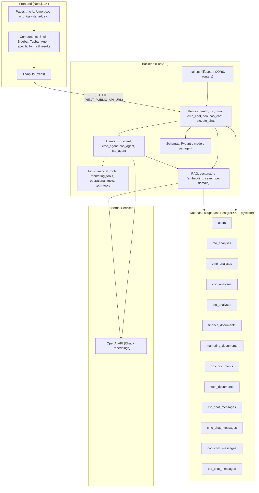
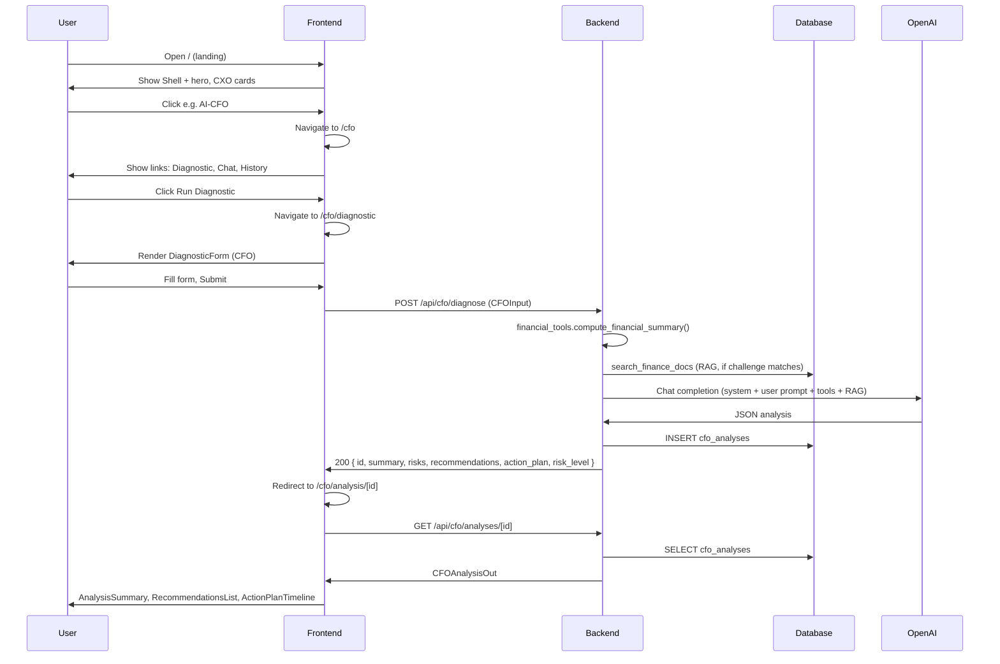
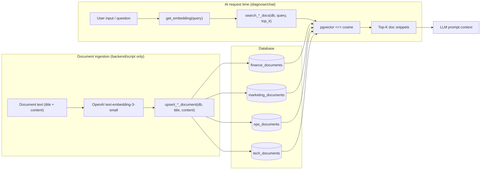
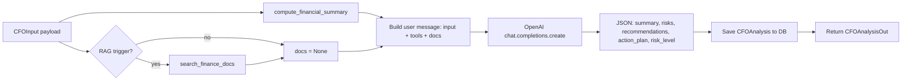
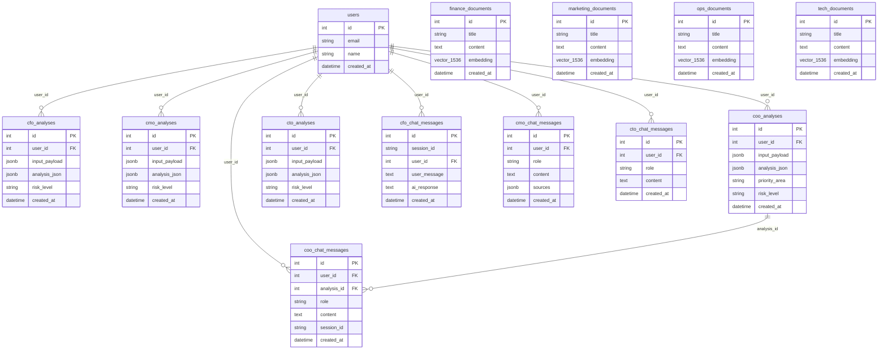

# Exec-Connect: Architecture & Documentation

Complete reference for system architecture, data flow, database schema, and customization.

---

## 1. SYSTEM ARCHITECTURE DIAGRAM (Mermaid)



**API routes summary:**

| Prefix | Purpose |
|--------|--------|
| (none) | `GET /` – root; `GET /health` – health check |
| `/api/cfo` | `POST /diagnose`, `GET /analyses`, `GET /analyses/{id}`, `POST /chat` |
| `/api/cmo` | `POST /diagnose`, `GET /analyses`, `GET /analyses/{analysis_id}` |
| `/api/cmo/chat` | `POST ""`, `GET /messages` |
| `/api/coo` | `POST /diagnose`, `GET /analyses`, `GET /analyses/{analysis_id}` |
| `/api/coo/chat` | `POST /message`, `GET /history` |
| `/api/cto` | `POST /diagnose`, `GET /analyses`, `GET /analyses/{analysis_id}` |
| `/api/cto/chat` | `POST ""`, `GET /history` |

**Authentication:** Not implemented. `user_id` is optional (often `None`). CTO/CMO chat routes have placeholder `user_email` / `user_id` for future auth.

**RAG flow (high level):** When `RAG_ENABLED=true`, diagnose/chat routes build a query, call `search_*_docs(db, query, top_k)`, get embeddings from OpenAI, run pgvector similarity search, and inject document snippets into the LLM prompt.

---

## 2. DATA FLOW DIAGRAMS (Mermaid)

### 2.1 User journey: Landing → Agent → Diagnostic → Analysis → Results



### 2.2 Document and RAG flow (no user upload in current API)



Note: There are **no public API endpoints** for uploading documents. RAG tables are populated via backend code (e.g. scripts or admin tools calling `upsert_*_document`). To add user-facing upload, you would add routes that accept file/text and call the vectorstore upsert functions.

### 2.3 Chat flow: Frontend → Backend → OpenAI → Database

```mermaid
sequenceDiagram
    participant U as User
    participant F as Frontend
    participant B as Backend
    participant DB as Database
    participant O as OpenAI

    U->>F: Type message, Send (e.g. CFO chat)
    F->>B: POST /api/cfo/chat { message, session_id?, user_id? }
    B->>O: Chat completion (CHAT_SYSTEM_PROMPT + message)
    O->>B: Assistant reply
    B->>DB: INSERT cfo_chat_messages (user_message, ai_response, session_id)
    B->>F: CFOChatResponse (session_id, user_message, ai_response)
    F->>U: Append message to UI

    Note over B,DB: CMO chat: RAG search_marketing_docs(question), then OpenAI; store in cmo_chat_messages
    Note over B,DB: COO chat: optional analysis_id for context; run_chat_agent with history; store in coo_chat_messages
    Note over B,DB: CTO chat: RAG search_tech_docs; store in cto_chat_messages
```

### 2.4 Analysis generation flow (e.g. CFO)



---

## 3. DATABASE SCHEMA DIAGRAM (Mermaid)



---

## 4. FRONTEND STRUCTURE ANALYSIS

### Page structure

| Route | Purpose |
|-------|--------|
| `/` | Landing: hero, benefits, how it works, CXO cards, case studies, CTA |
| `/get-started` | Onboarding / qualification |
| `/how-it-works`, `/who-we-help`, `/why-exec-connect` | Marketing content |
| `/about`, `/case-studies`, `/insights`, `/ecosystem` | Marketing / info |
| `/book-call`, `/book-diagnostic`, `/book-cxo/[id]` | Booking flows |
| `/cxos`, `/cxos/[id]` | CXO listing and detail |
| `/cfo`, `/cmo`, `/coo`, `/cto` | Agent hub: links to Diagnostic, Chat, History or Analyses |
| `/cfo/diagnostic`, `/cmo/diagnostic`, `/coo/diagnostic`, `/cto/diagnostic` | Agent-specific diagnostic form |
| `/cfo/chat`, `/cmo/chat`, `/coo/chat`, `/cto/chat` | Agent-specific chat UI |
| `/cfo/history` | List of past CFO analyses (CFO only) |
| `/cfo/analysis`, `/cmo/analysis`, `/coo/analysis`, `/cto/analysis` | List of analyses (where applicable) |
| `/cfo/analysis/[id]`, `/cmo/analysis/[id]`, etc. | Single analysis result (summary, recommendations, action plan) |

### Component hierarchy

- **Layout:** `Shell` wraps Topbar and optionally Sidebar. Marketing routes use Topbar + main only; agent routes use Topbar + Sidebar + main.
- **Reusable UI:** `components/ui/` – Card, Button, Input, Label, Select, Textarea, Checkbox, RadioGroup, Slider, Tabs, Badge, Progress (Radix-based, Tailwind).
- **Layout:** `components/layout/` – Shell, Sidebar, Topbar.
- **Agent-specific:** `components/cfo/`, `components/cmo/`, `components/coo/`, `components/cto/` – each has DiagnosticForm, AnalysisSummary, RecommendationsList, ActionPlanTimeline; CMO/COO/CTO have ChatInterface; CTO has RisksList.

### State management

- No global store (Redux/Zustand). Local React state (`useState`) and `useEffect` for data fetching. Router (`useRouter`, `useParams`) for navigation and IDs.

### API client (`lib/api.ts`)

- Single axios instance: `baseURL` from `NEXT_PUBLIC_API_URL` or `NEXT_PUBLIC_API_BASE_URL` or `http://localhost:8000`.
- Functions per agent: `postCfoDiagnostic`, `getCfoAnalyses`, `getCfoAnalysis`, `postCfoChat`; similar for CMO, COO, CTO. Legacy aliases: `getAnalyses`, `getAnalysis`, `api`, `cooApi`, `ctoApi`.

### Styling

- **Tailwind CSS** for layout and utilities.
- **Radix UI** primitives in `components/ui/` (shadcn-style: card, button, input, select, etc.).
- **lucide-react** for icons.

---

## 5. BACKEND STRUCTURE ANALYSIS

### FastAPI app structure

- **Entry:** `app/main.py` – FastAPI app, lifespan (DB check, pgvector, optional migrations), CORS, mounts health + 8 routers.
- **Config:** `app/config.py` – pydantic-settings: `DATABASE_URL`, `OPENAI_API_KEY`, `LLM_MODEL`, `RAG_ENABLED`, `RAG_TOP_K`, `CORS_ORIGINS`, etc.
- **DB:** `app/db/database.py` – engine, SessionLocal, `get_db`, `init_pgvector_extension`. `app/db/models.py` – all SQLAlchemy models.
- **Routes:** `app/routes/` – health, cfo_routes, cmo_routes, cmo_chat_routes, coo_routes, coo_chat_routes, cto_routes, cto_chat_routes.
- **Agents:** `app/agents/` – cfo_agent, cmo_agent, coo_agent, cto_agent (OpenAI calls, system/user prompts).
- **Tools:** `app/tools/` – financial_tools, marketing_tools, operational_tools, tech_tools (metrics, scores, hints).
- **RAG:** `app/rag/vectorstore.py` – `get_embedding`, `upsert_*_document`, `search_*_docs` for finance, marketing, ops, tech.
- **Schemas:** `app/schemas/{cfo,cmo,coo,cto}/` – Pydantic input/analysis/chat models.

### API endpoints by agent

- **CFO:** POST `/api/cfo/diagnose`, GET `/api/cfo/analyses`, GET `/api/cfo/analyses/{id}`, POST `/api/cfo/chat`.
- **CMO:** POST `/api/cmo/diagnose`, GET `/api/cmo/analyses`, GET `/api/cmo/analyses/{analysis_id}`; chat: POST `/api/cmo/chat`, GET `/api/cmo/chat/messages`.
- **COO:** POST `/api/coo/diagnose`, GET `/api/coo/analyses`, GET `/api/coo/analyses/{analysis_id}`; chat: POST `/api/coo/chat/message`, GET `/api/coo/chat/history`.
- **CTO:** POST `/api/cto/diagnose`, GET `/api/cto/analyses`, GET `/api/cto/analyses/{analysis_id}`; chat: POST `/api/cto/chat`, GET `/api/cto/chat/history`.

### Database models (purpose)

- **User:** Optional identity; CTO/CMO create/get user for chat.
- **CFO/CMO/COO/CTO analyses:** Store `input_payload`, `analysis_json`, `risk_level` (and COO `priority_area`); used for history and analysis detail.
- **Document tables (finance, marketing, ops, tech):** Store title, content, embedding (1536-d) for RAG.
- **Chat tables:** Store conversation by agent; CFO by session_id; CMO/COO/CTO by role/content; COO can link to `analysis_id`.

### OpenAI integration

- All agents use `openai` SDK; CTO (and optionally CFO) use custom `httpx.Client` for timeouts. Model from `settings.LLM_MODEL` (e.g. gpt-4). Diagnostics use `response_format={"type": "json_object"}`; chat uses free-form text.

### RAG implementation

- **Embedding:** `get_embedding(text)` → OpenAI `text-embedding-3-small`, 1536-d.
- **Storage:** Finance/Marketing/Ops/Tech documents: `Vector(1536)` in PostgreSQL (pgvector). Upsert via `upsert_*_document` (no public upload API).
- **Search:** `search_*_docs(db, query, top_k)`: embed query, then pgvector `<=>` (cosine distance) or equivalent, return top-k docs. Used in diagnose (when trigger conditions match) and in CMO/CTO chat.

### Environment variables

- `DATABASE_URL` – PostgreSQL (Supabase); use `postgresql+psycopg://` and URL-encode password if needed.
- `OPENAI_API_KEY`, `LLM_MODEL` – OpenAI.
- `RAG_ENABLED`, `RAG_TOP_K` – RAG on/off and number of docs.
- `CORS_ORIGINS` – Comma-separated frontend origins.

---

## 6. AI AGENT LOGIC EXPLANATION

### CFO (AI-CFO)

- **Role:** Virtual CFO for SMEs in South-East Asia; cash flow and working capital first, then profitability.
- **Diagnostic input (CFOInput):** Biggest challenge, monthly revenue/expenses, cash, debt, upcoming payments, funding structure, financial statements, systems, unit economics, industry, markets, FX, revenue streams, collection period, overdue %, inventory, credit facilities, risk appetite, KPIs, fundraising plan, confidence score, cost initiatives, notes.
- **Tools:** `compute_financial_summary` – gross margin, burn, runway, cash flow risk, unit economics hint.
- **RAG:** Triggered for challenges `cash_flow_management`, `forecasting_budgeting`, `financial_risk_management`; `search_finance_docs` with query like "SME {challenge} best practices"; snippets added to prompt.
- **Prompt:** System prompt defines JSON output (summary, primary_issue, risks, recommendations, action_plan.week/month/quarter, risk_level green/yellow/red) and SEA context. User message = diagnostic JSON + tools + optional RAG.
- **Output:** JSON with summary, primary_issue, risks[], recommendations[], action_plan{week,month,quarter}, risk_level. Stored in `cfo_analyses`, returned as CFOAnalysisOut.
- **Chat:** CHAT_SYSTEM_PROMPT (CFO expertise, concise, SEA context); no RAG; reply stored in `cfo_chat_messages`.

### CMO (AI-CMO)

- **Role:** Marketing consultant for SMEs in Southeast Asia; strategy, channels, budget, metrics.
- **Diagnostic input (CMOInputSchema):** primary_challenge, effective_channels, marketing_plan_status, metrics_review_frequency, marketing_budget_percent, customer_segmentation, marketing_tools, brand_confidence, strategy_alignment, notes.
- **Tools:** `basic_marketing_hint`, `detect_risk_level` (from marketing_tools).
- **RAG:** Always used when RAG_ENABLED; `search_marketing_docs(db, query_from_input, top_k)`; query from primary_challenge, channels, strategy_alignment.
- **Prompt:** System prompt requires JSON (summary, primary_issue, risks, recommendations, action_plan, risk_level). User prompt = diagnostic fields + tools hint + RAG context.
- **Output:** Same JSON shape; stored in `cmo_analyses`.
- **Chat:** CMO chat route uses RAG on the user question; stores role/content/sources in `cmo_chat_messages`.

### COO (AI-COO)

- **Role:** Virtual COO for SMEs in Asia/South-East Asia; operations, throughput, quality, delivery, processes, costs.
- **Diagnostic input (COOInput):** biggest_operational_challenge, monthly_output_units, monthly_ops_costs, on_time_delivery_rate, defect_or_return_rate, has_documented_sops, kpi_tracking_method, cost overruns, vendor maturity, workforce, business model, etc.
- **Tools:** `calculate_throughput_trend`, `calculate_average_ops_cost`, `estimate_capacity_utilization`, `classify_service_reliability`, `basic_ops_hint`.
- **RAG:** When challenge in `scaling_operations`, `supply_chain_inefficiencies`; `search_ops_docs` with SME operations best practices query; snippets passed to agent.
- **Prompt:** System prompt defines JSON (summary, primary_issue, priority_area, risks, recommendations, action_plan, risk_level). User message = COO input + tools results + optional docs.
- **Output:** JSON with priority_area and risk_level; stored in `coo_analyses`.
- **Chat:** `run_chat_agent` with optional analysis_context and chat_history (last 10); no RAG in chat; stored in `coo_chat_messages` with optional `analysis_id` and `session_id`.

### CTO (AI-CTO)

- **Role:** Technology strategy, infrastructure, DevOps, security, team, roadmap for SMEs in Southeast Asia.
- **Diagnostic input (CTOInputSchema):** biggest_challenge, tech_stack_maturity, devops_maturity, has_security_policies, team structure, etc.
- **Tools:** `calculate_all_tools` – infra score, DevOps maturity, risk level, cloud efficiency, hints.
- **RAG:** `search_tech_docs(db, query_from_input, 4)`; query from biggest_challenge, tech_stack_maturity, notes. Results (title, content, similarity) passed as rag_context.
- **Prompt:** System prompt + user prompt with input JSON, tools summary, RAG snippets; response must be JSON (summary, primary_issue, risks[], recommendations[], action_plan{week,month,quarter}, risk_level low/medium/high). CTO uses richer risk/recommendation structures (title, description, severity/priority, impact).
- **Output:** Structured analysis; stored in `cto_analyses`.
- **Chat:** CTO chat uses RAG on message; stores in `cto_chat_messages`; can return history.

---

## 7. CONCEPT NOTE (Executive Summary)

### What is Exec-Connect?

Exec-Connect is a **unified AI-powered platform** that provides on-demand strategic leadership for small and medium enterprises (SMEs). It offers four virtual CXO agents—AI-CFO, AI-CMO, AI-COO, and AI-CTO—that deliver diagnostics, actionable recommendations, and conversational advice tailored to each business function and to regional context (e.g. South-East Asia).

### What problem does it solve?

SMEs often lack access to full-time C-suite expertise due to cost and availability. Exec-Connect addresses this by:

- **Democratizing access:** Any SME can run structured diagnostics and get AI-generated analyses and action plans.
- **Speed:** Insights in minutes instead of weeks.
- **Cost:** Fraction of the cost of hiring or retaining full-time executives.
- **Continuity:** Chat and history allow follow-up and iteration without scheduling.

### Who is it for?

- **Primary:** Small and medium enterprises (e.g. 1–50 employees) in Malaysia and emerging markets (South-East Asia, Asia).
- **Context:** Aligned with initiatives such as Be Noor Foundation—supporting businesses that need strategic guidance but have limited budget for senior talent.
- **Use cases:** Founders and managers who want financial clarity, marketing strategy, operations improvement, or technology roadmap without committing to full-time CXO hires.

### How does it work? (High-level user experience)

1. User lands on the site and chooses an agent (CFO, CMO, COO, or CTO).
2. User runs a **diagnostic** by completing a structured form (challenges, metrics, systems, etc.).
3. Backend computes **tools** (metrics/scores), optionally fetches **RAG** documents, and calls **OpenAI** to produce a structured analysis.
4. User sees **summary, risks, recommendations, and action plan** (week/month/quarter) and can open **chat** for follow-up questions.
5. **Chat** is persisted; CMO/CTO chat can use RAG to ground answers in stored documents.

### What makes it unique?

- **Four integrated agents** in one product (finance, marketing, operations, technology).
- **RAG-augmented diagnostics and chat** (where enabled) so answers can reference uploaded or preloaded domain documents.
- **Structured outputs** (JSON) so the product can show consistent UI (risk level, action plan, recommendations) across agents.
- **Regional framing** in prompts (currencies, regulations, informal finance, family businesses) for South-East Asia.

### Technical stack summary

- **Frontend:** Next.js 14, React 18, TypeScript, Tailwind CSS, Radix/shadcn-style UI, axios.
- **Backend:** FastAPI, SQLAlchemy, PostgreSQL (Supabase), pgvector, OpenAI API (chat + embeddings).
- **Deployment:** Backend and frontend can run separately (e.g. backend :8000, frontend :3003); DB and migrations via Alembic.

### MVP features vs. future roadmap

- **MVP (current):** Four agent diagnostics, agent-specific chat, analysis history, RAG when enabled, no auth, no user document upload.
- **Future potential:** User authentication, document upload for RAG, human CXO matching (book-call/book-cxo), more agents or deeper integrations, multi-language, payment/subscription.

---

## 8. FEATURE INVENTORY

### What works now

- Landing and marketing pages (how it works, who we help, case studies, get-started, book-diagnostic, etc.).
- **CFO:** Full diagnostic form, submit → analysis, list analyses, view analysis by id, chat (no RAG).
- **CMO:** Diagnostic, analyses list/detail, chat with RAG on question.
- **COO:** Diagnostic (with RAG for certain challenges), analyses list/detail, chat (with optional analysis context and session history).
- **CTO:** Diagnostic (with tools + RAG), analyses list/detail, chat with RAG.
- Backend: All routes above, DB persistence, migrations, pgvector, config from env.

### Partially implemented

- **User identity:** user_id is often null; CTO/CMO create/get User for chat but no real login.
- **RAG document population:** Upsert functions exist but no public upload API; documents must be added via backend/scripts.

### Placeholder / stub

- Auth (login/signup) – not implemented.
- Book-call / book-cxo flows – pages exist; backend integration for scheduling not verified.
- Some marketing copy and case study content may be placeholder.

### Dependencies

- **OpenAI:** Required for all agent and chat responses and for RAG embeddings. Without a valid key, diagnostics and chat fail.
- **Supabase (PostgreSQL + pgvector):** Required for persistence and RAG. Connection string and password encoding must be correct.

---

## 9. CRITICAL FILES REFERENCE GUIDE

| Purpose | Location |
|--------|----------|
| **Backend entry, CORS, routers** | `backend/app/main.py` |
| **Config, env vars** | `backend/app/config.py` |
| **DB models** | `backend/app/db/models.py` |
| **DB connection** | `backend/app/db/database.py` |
| **CFO API** | `backend/app/routes/cfo_routes.py` |
| **CMO API** | `backend/app/routes/cmo_routes.py`, `backend/app/routes/cmo_chat_routes.py` |
| **COO API** | `backend/app/routes/coo_routes.py`, `backend/app/routes/coo_chat_routes.py` |
| **CTO API** | `backend/app/routes/cto_routes.py`, `backend/app/routes/cto_chat_routes.py` |
| **CFO agent + prompts** | `backend/app/agents/cfo_agent.py` |
| **CMO agent + prompts** | `backend/app/agents/cmo_agent.py` |
| **COO agent + prompts** | `backend/app/agents/coo_agent.py` |
| **CTO agent + prompts** | `backend/app/agents/cto_agent.py` |
| **RAG (embed + search)** | `backend/app/rag/vectorstore.py` |
| **Financial tools** | `backend/app/tools/financial_tools.py` |
| **Tech tools** | `backend/app/tools/tech_tools.py` |
| **CFO input/analysis schemas** | `backend/app/schemas/cfo/` |
| **Frontend API client** | `frontend/src/lib/api.ts` |
| **Frontend types** | `frontend/src/lib/types.ts`, `types-cmo.ts`, `types-coo.ts`, `types-cto.ts` |
| **Root layout** | `frontend/src/app/layout.tsx` |
| **Landing page** | `frontend/src/app/page.tsx` |
| **Shell (layout + sidebar logic)** | `frontend/src/components/layout/Shell.tsx` |
| **UI primitives** | `frontend/src/components/ui/*.tsx` |
| **CFO diagnostic form** | `frontend/src/components/cfo/DiagnosticForm.tsx` |
| **CFO analysis view** | `frontend/src/app/cfo/analysis/[id]/page.tsx` |
| **Global styles** | `frontend/src/app/globals.css` |
| **Tailwind config** | `frontend/tailwind.config.ts` |
| **Env (backend)** | `backend/.env` |
| **Env (frontend)** | `frontend/.env.local` (NEXT_PUBLIC_API_URL) |
| **Migrations** | `backend/alembic/versions/*.py` |

---

## 10. CUSTOMIZATION ROADMAP

### Easy wins (config / copy / UI tweaks)

- **Copy and branding:** Change hero text, agent descriptions, case study text, and “Exec Connect” naming in `frontend/src/app/page.tsx` and other marketing pages.
- **Colors and theme:** Adjust Tailwind classes and gradients (e.g. blue/purple/green) in `globals.css`, `tailwind.config.ts`, and component classes.
- **Agent cards:** Update titles and descriptions on landing and in Sidebar (e.g. `frontend/src/components/layout/Sidebar.tsx`).
- **CORS / API URL:** Add or change origins in `backend/app/config.py`; set `NEXT_PUBLIC_API_URL` in `frontend/.env.local`.
- **LLM model:** Change `LLM_MODEL` in `.env` (e.g. gpt-4 vs gpt-4o).

### Medium complexity (code changes, same architecture)

- **Diagnostic fields:** Add/remove fields in backend schema (`app/schemas/*/cfo_input.py` etc.) and in frontend form components; re-run migrations if DB schema changes.
- **Prompts:** Edit system/user prompts in `backend/app/agents/*.py` to change tone, structure, or JSON shape; adjust frontend types and UI if output schema changes.
- **RAG triggers:** Change when RAG runs (e.g. which challenges or which routes) in route files and agent calls.
- **New UI sections:** Add components (e.g. extra cards on analysis page) and wire to existing API responses.

### Complex (architecture / new capabilities)

- **New agent (e.g. CHRO):** Add model(s), migration, schema, routes, agent module, tools, frontend pages and components, and API client; register router in `main.py`.
- **Document upload for RAG:** Add authenticated (or admin) upload endpoint, parse/store files, call `upsert_*_document`; add frontend upload UI and possibly document list.
- **Authentication:** Add auth (e.g. JWT or session), protect routes, set `user_id` from current user; add login/signup and user context on frontend.
- **Different AI provider:** Replace OpenAI with another provider (different SDK, embedding API, and prompt format) in agents and RAG; keep same JSON contracts for compatibility.

---

*Generated from codebase scan. For the latest behavior, refer to the source files listed in Section 9.*
