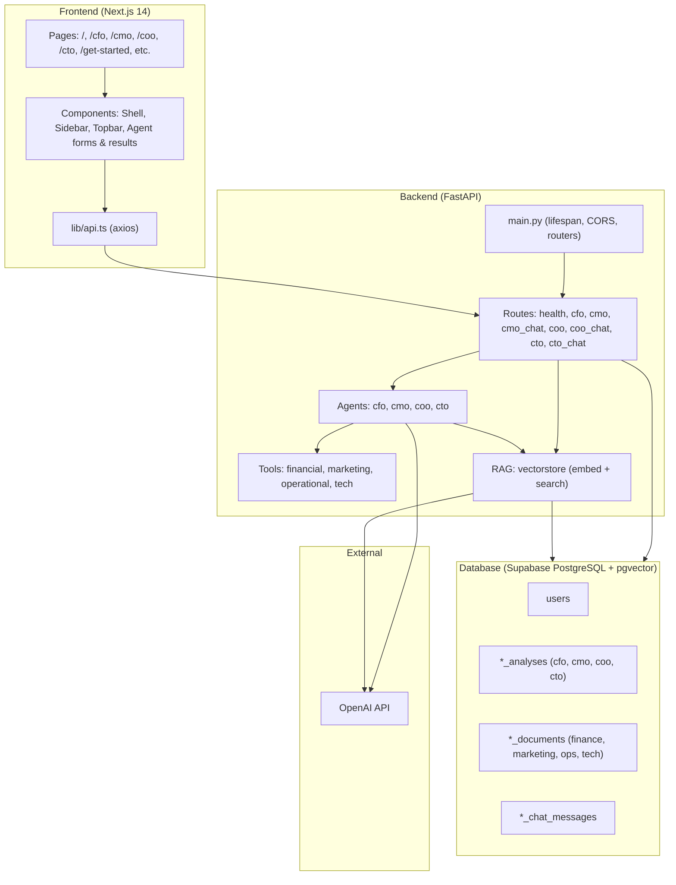
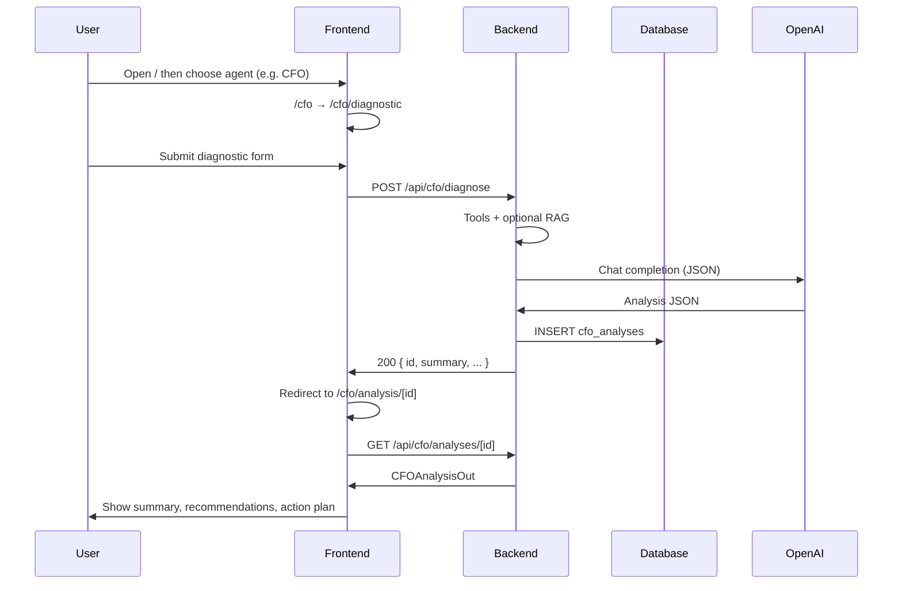
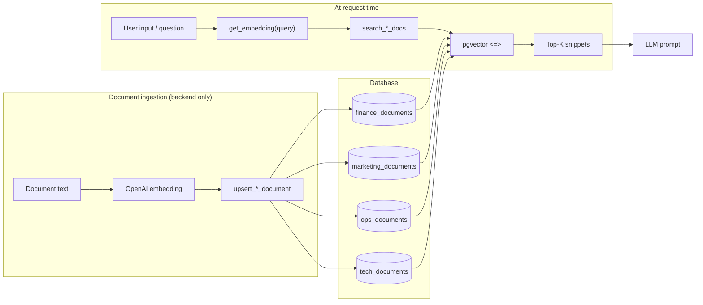
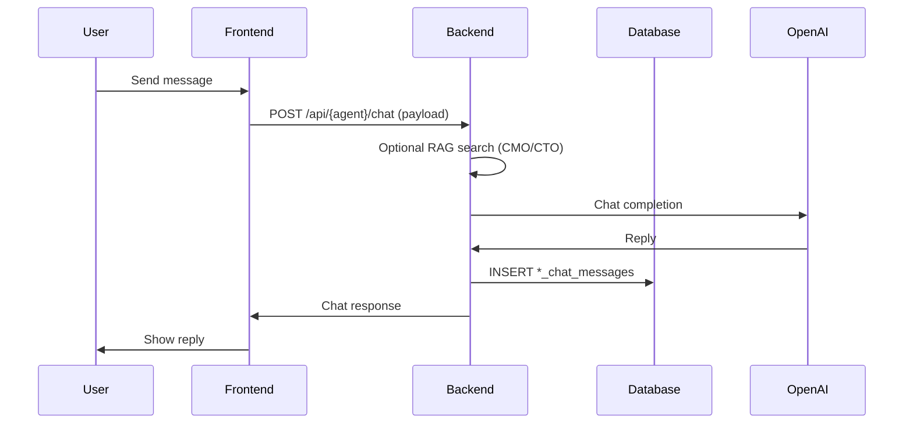
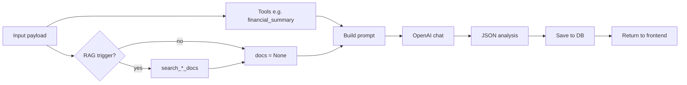
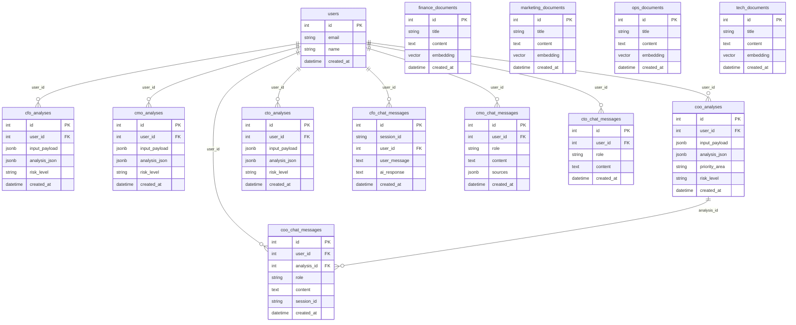

# Exec-Connect: Mermaid Diagrams (Copy-Paste Ready)

Use these in Mermaid-compatible tools (e.g. GitHub, Notion, VS Code Mermaid preview, or [mermaid.live](https://mermaid.live)).

---

## 1. System architecture

---

## 2. User journey: Landing → Agent → Diagnostic → Analysis → Results

---

## 3. Document and RAG flow

---

## 4. Chat flow: Frontend → Backend → OpenAI → Database

---

## 5. Analysis generation flow (e.g. CFO)

---

## 6. Database schema (ER)

---

*Source: ARCHITECTURE_AND_DOCUMENTATION.md*
