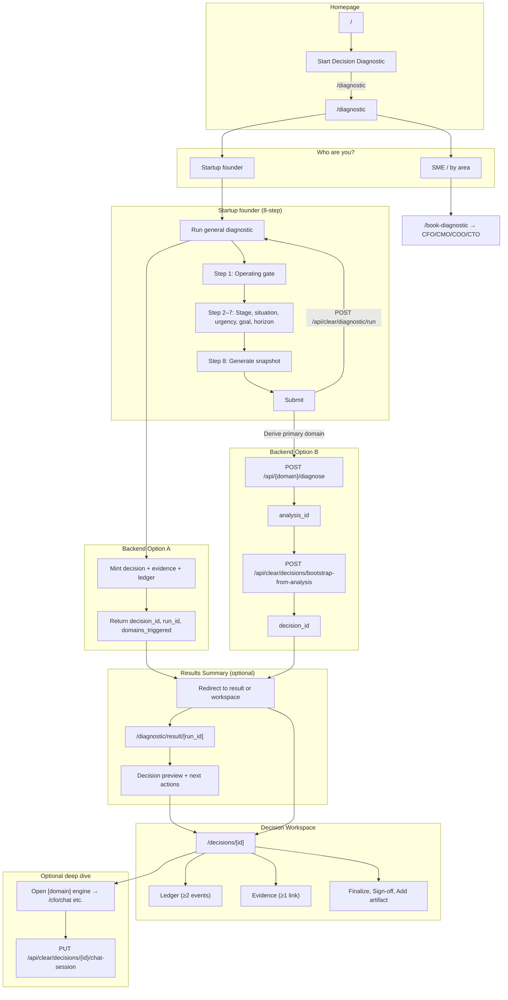

# CLEAR Homepage Interaction Architecture and UI Wiring

**Role:** CLEAR Product and UX Interaction Architect  
**Scope:** Interaction first, visuals second. No marketing copy, no branding redesign.  
**Non-negotiables:** Homepage CTA starts diagnostic; value in ~30s (input → receive → next); structured UI, no long text walls. **Two personas:** (1) **Startup founder** → 8-step situation/clarifiers/urgency wizard (primary). (2) **SME** → legacy per-area diagnostics (CFO/CMO/COO/CTO). When user clicks diagnostic from homepage they **choose who they are** (founder vs SME), unless we can infer from profile (e.g. name, industry, geography when available).

---

## 1. Current Route Map vs Required Route Map

### 1.1 Current (existing) routes

| Route | Purpose | Notes |
|-------|---------|--------|
| `/` | Homepage | Governance copy only; no diagnostic CTA |
| `/get-started` | Lead form | No API POST; routes to one agent diagnostic by choice |
| `/book-diagnostic` | Choice: General → get-started, or Areas → agent diagnostics | No general diagnostic API |
| `/cfo/diagnostic`, `/cmo/diagnostic`, `/coo/diagnostic`, `/cto/diagnostic` | Per-agent wizard | POST to `/api/cfo|.../diagnose`; redirect to analysis |
| `/cfo/analysis/[id]`, etc. | Analysis result | Dynamic; no link to Decision Workspace |
| `/decisions` | Decision list | CLEAR API |
| `/decisions/new` | Create blank decision | CLEAR API |
| `/decisions/[id]` | Decision Workspace | Ledger, evidence, finalize, sign-off; comment re chat-session |
| `/cfo/chat`, `/cmo/chat`, etc. | Agent chat | Not yet tagged to decision_id via chat-session |

### 1.2 Required (new or changed) routes

| Route | Purpose | New? |
|-------|---------|------|
| `/` | Homepage | **Change:** Add primary CTA (e.g. "Start Decision Diagnostic" or "Get started") → `/diagnostic`; add structured blocks (hero, 3-step strip, what-you-receive cards, how-it-works diagram, footer CTA). Optional secondary: "See How It Works" → `/#how-it-works`. |
| `/diagnostic` | **Who are you?** (persona choice) | **Required.** User chooses: **Startup founder** → `/diagnostic/run` (8-step wizard), or **SME / by area** → `/book-diagnostic` (then pick Finance/Growth/Ops/Tech). Optional: when profile has name, industry, geography, etc., we can pre-select or skip choice (phase later). |
| `/diagnostic/run` | **Startup founder diagnostic** (9-step wizard) | **Implemented.** Operating gate → business stage (dropdown + text) → situation (dropdown + text) → clarifiers (dropdown + text) → most urgent (+ optional notes) → goal (+ optional notes) → **document upload** → decision horizon (dropdown + text) → generate. Each question has multiple choice/dropdown plus free text/voice. |
| `/diagnostic/msme` | **MSME diagnostic** (4-step wizard) | **Implemented.** Step 1: "Which of these feel most true?" multi-select + optional text. Step 2: Primary focus (dropdown + text). Step 3: Document upload. Step 4: Generate. Same endpoint; flow → result → AI advisor → CXO agents. |
| `/diagnostic/result/[run_id]` | **Results Summary** (or redirect to `/decisions/[id]`) | Show: reformulated problem, constraint areas (finance/market/ops/tech) with confidence, Decision Record preview, next actions (Create/Continue Decision Workspace, Chat with engine, Run another). If backend mints decision immediately, can redirect to `/decisions/[id]`. |
| `/decisions/[id]` | Decision Workspace | **No route change.** Must show: Decision Record (draft), Evidence list, Ledger; actions: add constraints/options, validate, finalize, sign-off. Ensure "Chat with engine" tags session via `PUT /api/clear/decisions/{id}/chat-session`. |
| `/cfo/diagnostic`, `/cmo/diagnostic`, `/coo/diagnostic`, `/cto/diagnostic` | **SME (legacy) per-area diagnostics** | **Preserve.** Used when user chooses SME from `/diagnostic` (via `/book-diagnostic`) or lands directly. Domain-specific questions; POST to `/api/{domain}/diagnose`. |

---

## 2. Exact Frontend Tasks and File Locations (Next.js App Router)

### 2.1 Homepage (`/`)

| Task | File(s) | Action |
|------|---------|--------|
| Add primary CTA | `frontend/src/app/page.tsx` | Add one primary button/link: "Start Decision Diagnostic" → `href="/diagnostic"`. Place in hero block. |
| Add optional secondary CTA | Same | Optional link: "See How It Works" → `href="/#how-it-works"` (anchor on same page). |
| Replace long copy with structured blocks | Same | (1) Hero: one-sentence value + primary CTA. (2) "What you do" 3-step strip: Input → System → Output (labels only or minimal copy). (3) "What you receive" cards: Decision Record, Constraint Map, Next Steps. (4) "How it works" diagram: use `HowItWorksDiagram` component (3 nodes: Diagnose → Decision Record → Execution and Outcomes). (5) Footer CTA: repeat "Start Decision Diagnostic" or link to `/diagnostic`. |
| Register marketing-style pages for Shell | `frontend/src/components/layout/Shell.tsx` | Ensure `/diagnostic` and `/diagnostic/result/*` are treated as app pages (sidebar shown) or marketing (no sidebar) per existing `marketingPages` logic. Recommendation: `/diagnostic` and `/diagnostic/result/*` = app (show sidebar). |

### 2.2 "Who are you?" choice (diagnostic entry)

| Task | File(s) | Action |
|------|---------|--------|
| Persona choice on `/diagnostic` | `frontend/src/app/diagnostic/page.tsx` | When user arrives from homepage (or direct), show **two options**: (1) **Startup founder** — "I'm building or running an early-stage company" → link to `/diagnostic/run` (8-step wizard). (2) **SME / by area** — "I want a focused diagnostic by area" → link to `/book-diagnostic` (then choose Finance, Growth, Ops, or Tech). Optional (phase later): if profile/onboarding has name, industry, geography, pre-fill or suggest "Continue as founder" and still allow switching. |
| Profile-based routing (optional) | Same + `frontend/src/lib/onboarding-context.ts` | When `getOnboardingContext()` returns name, industry, country, etc., we can skip the choice or pre-select "Startup founder" and still show the other option. Not required for MVP. |

### 2.3 Startup founder diagnostic (8-step wizard)

| Task | File(s) | Action |
|------|---------|--------|
| Wizard route | `frontend/src/app/diagnostic/run/page.tsx` | Renders `DiagnosticWizard` (already implemented). |
| Wizard component | `frontend/src/components/diagnostic/DiagnosticWizard.tsx` | **8 steps:** (1) Operating/revenue gate (yes/no; "no" → idea-stage off-ramp). (2) Business stage (free text). (3) Situation description (free text). (4) Clarifiers (optional, comma-separated). (5) Most urgent (Cash/runway, Operations, Growth/demand, Technology). (6) Main goal (Improve cash flow, Scale operations, Investor ready, Just clarify). (7) Decision horizon (e.g. 3 months). (8) "Generate my decision snapshot". Validation per step; guest mode. |
| Persist progress (guest) | Same component or `frontend/src/lib/diagnostic-storage.ts` | On step change or blur, write to `localStorage` key e.g. `clear_diagnostic_draft`. On mount, read and restore if present. Clear on successful submit or explicit "Start over". |
| Submit handler | `DiagnosticWizard.tsx` | On submit: call `POST /api/clear/diagnostic/run` (or equivalent) with `onboarding_context` + `diagnostic_data`; on response get `decision_id`; redirect to `/diagnostic/result/[run_id]` or `/decisions/[id]`. Show `ProcessingPanel` during request. |

### 2.4 Processing state

| Task | File(s) | Action |
|------|---------|--------|
| Processing UI | `frontend/src/components/diagnostic/ProcessingPanel.tsx` | New component: status text ("Generating decision snapshot"), spinner, copy "This may take a minute." Use while waiting for diagnostic run or bootstrap. |

### 2.5 Results Summary (if not redirecting straight to Decision Workspace)

| Task | File(s) | Action |
|------|---------|--------|
| Create route | `frontend/src/app/diagnostic/result/[run_id]/page.tsx` | New page. Fetch run result if backend provides `GET /api/clear/diagnostic/run/[run_id]`; otherwise this page may receive state via redirect params (e.g. decision_id) or be skipped when backend mints decision immediately. |
| Results view | `frontend/src/components/diagnostic/ResultsSummary.tsx` | Four blocks: (1) Reformulated problem statement. (2) Likely constraint areas (finance, market, ops, tech) with confidence. (3) What you receive: Decision Record preview (use `DecisionPreviewCard`). (4) Next actions: "Create Decision Workspace" / "Continue to Decision Workspace" → `/decisions/[id]`, "Chat with [domain] engine" → `/cfo/chat` (etc.) with decision context, "Run another diagnostic" → `/diagnostic`. |

### 2.6 Decision preview and cards

| Task | File(s) | Action |
|------|---------|--------|
| Decision preview card | `frontend/src/components/diagnostic/DecisionPreviewCard.tsx` | Shows: problem statement, constraints (empty allowed but flagged), domains triggered. Used in Results Summary and optionally on Decision Workspace. |

### 2.7 How It Works diagram

| Task | File(s) | Action |
|------|---------|--------|
| Diagram component | `frontend/src/components/diagnostic/HowItWorksDiagram.tsx` | Simple diagram: 3 nodes — Diagnose → Decision Record → Execution and Outcomes. Can be SVG or Mermaid-in-React or static image; no marketing copy. |

### 2.8 Decision Workspace and chat tagging

| Task | File(s) | Action |
|------|---------|--------|
| Ensure evidence and ledger visible | `frontend/src/app/decisions/[id]/page.tsx` | Already loads ledger and evidence. Verify at least 2 ledger events and at least 1 evidence link after bootstrap-from-analysis. |
| Tag chat session when opening from workspace | `frontend/src/app/decisions/[id]/page.tsx` + agent chat pages | When user clicks "Open Finance Engine" (or CMO/COO/CTO): navigate to `/cfo/chat` (etc.) and pass `decision_id` (query or state). On chat page mount, if `decision_id` present, call `PUT /api/clear/decisions/{id}/chat-session` with current session_id and agent_domain. Implement in `frontend/src/app/cfo/chat/page.tsx` (and cmo/coo/cto) or in a shared hook that chat pages use. |
| New problem = new diagnostic | `frontend/src/app/diagnostic/page.tsx` or Shell | If user starts a new problem, force a new diagnostic run (new run_id / decision_id). Do not reuse previous run; clear localStorage draft when starting fresh. |

### 2.9 API client (frontend)

| Task | File(s) | Action |
|------|---------|--------|
| General diagnostic run (when backend exists) | `frontend/src/lib/clear-api.ts` | Add `runGeneralDiagnostic(payload: GeneralDiagnosticPayload): Promise<DiagnosticRunResponse>` calling `POST /api/clear/diagnostic/run`. Types: `GeneralDiagnosticPayload`, `DiagnosticRunResponse` (decision_id, run_id, domains_triggered, draft_artifact_preview, next_actions). |
| Bootstrap (already exists) | `frontend/src/lib/clear-api.ts` | `bootstrapDraftFromAnalysis({ domain, analysis_id, enterprise_id? })` already exists. Use when general endpoint is not built. |
| Map wizard payload to agent payload | `frontend/src/lib/diagnostic-mapping.ts` (new) | Map general diagnostic payload (enterprise basics, decision to make, constraints) to the shape expected by one primary agent (e.g. CFO input shape) for "option B" (wizard → one agent diagnose → bootstrap). |

---

## 3. Exact Backend Endpoints Needed and What They Return

### 3.1 Option A: New general diagnostic endpoint (recommended)

| Method | Path | Request | Response | Notes |
|--------|------|---------|----------|--------|
| POST | `/api/clear/diagnostic/run` | JSON body: see **Minimum General Diagnostic Data Contract** below. | `201`: `{ "decision_id": "uuid", "run_id": "string", "domains_triggered": ["cfo" \| "cmo" \| "coo" \| "cto"], "draft_artifact_preview": { … }, "next_actions": ["view_workspace", "chat_cfo", …] }` | Backend: create or get enterprise (optional), run one or more agent diagnose internally (or pick primary domain and run one), create evidence links, create draft decision (CLEAR `create_decision` + artifact), write ledger events. Return decision_id so frontend can redirect to `/decisions/[id]`. run_id can equal decision_id or be a separate job id if async. |

**Startup founder diagnostic payload (8-step wizard — implemented):**

- **Request:** `onboarding_context` (optional: name, country, industry, company_size_band, email) + `diagnostic_data`: `operatingAndRevenue`, `businessStage`, `situationDescription`, `situationClarifiers` (array), `mostUrgent` (survive_cash | fix_ops | grow_demand | tech), `diagnosticGoal` (improve_cash_flow | scale_operations | investor_ready | ""), `decisionHorizon`, `clarityLevel`, `dataAvailable`, `riskLevel`.
- Backend maps this to existing agent input schemas (see `diagnostic-mapping.ts`) and/or runs the CLEAR diagnostic pipeline; returns `decision_id`, optionally `run_id`, `idea_stage` for off-ramp.

*(Alternative 3-step contract — sector, geography, decision_title, decision_statement, etc. — is not currently used; reserved for future SME or enterprise flows if needed.)*

### 3.2 Option B: No new endpoint (frontend-only wiring)

- No new backend route.
- Frontend wizard: collect same payload. Derive **primary domain** from `top_constraint_guess` or heuristics from `decision_statement`. Call existing `POST /api/cfo/diagnose` (or cmo/coo/cto) with a **mapped** payload (see `diagnostic-mapping.ts`). Backend returns analysis `id`. Frontend then calls existing `POST /api/clear/decisions/bootstrap-from-analysis?domain=cfo&analysis_id=123`. Response gives `decision_id`. Redirect to `/decisions/[decision_id]`. UI still presents one "general" diagnostic; backend is per-agent + bootstrap.

### 3.3 Chat session tagging (already exists)

| Method | Path | Request | Response |
|--------|------|---------|----------|
| PUT | `/api/clear/decisions/{decision_id}/chat-session` | Query: `session_id`, `agent_domain` (cfo \| cmo \| coo \| cto) | `{ "decision_id", "session_id", "agent_domain" }` |

Frontend must call this when user opens chat from Decision Workspace with a decision context.

---

## 4. End-to-End Flow (Mermaid)

---

## 5. Checklist for UI/UX Designer (Page Layout and Components)

Use this for implementation and handoff; no marketing copy or branding redesign.

### 5.1 Homepage

- [ ] **Hero:** One sentence value proposition + single primary CTA: "Start Decision Diagnostic" (links to `/diagnostic`).
- [ ] **Secondary CTA (optional):** "See How It Works" → anchor `/#how-it-works` on same page.
- [ ] **"What you do" strip:** 3 steps (Input → System → Output). Use labels/short phrases; no long paragraphs.
- [ ] **"What you receive" cards:** At least three cards: Decision Record, Constraint Map, Next Steps. Content can be one line each.
- [ ] **"How it works" diagram:** Single diagram with 3 nodes: Diagnose → Decision Record → Execution and Outcomes. Use `HowItWorksDiagram` component.
- [ ] **Footer:** CTA repeated (e.g. "Start Decision Diagnostic" or link to `/diagnostic`).
- [ ] **No long text walls:** Replace any paragraph-heavy block with cards, stepper, accordion, or tabs.

### 5.2 "Who are you?" choice (`/diagnostic`)

- [ ] **Two options:** (1) Startup founder → `/diagnostic/run` (8-step wizard). (2) SME / by area → `/book-diagnostic` (then Finance, Growth, Ops, Tech). Optional: when profile has name, industry, geography, suggest "Continue as founder" and still show SME option.

### 5.3 Startup founder wizard (`/diagnostic/run`)

- [ ] **Stepper header:** Visible steps 1–8.
- [ ] **Steps:** (1) Operating/revenue gate. (2) Business stage. (3) Situation description. (4) Clarifiers (optional). (5) Most urgent. (6) Main goal. (7) Decision horizon. (8) Generate snapshot.
- [ ] **Guest mode:** No sign-in required. Progress persistence in localStorage; clear on submit or "Start over".
- [ ] **Validation:** Per-step validation; "Next" / "Submit" only when required fields filled.
- [ ] **Submit:** Triggers backend; show `ProcessingPanel`; redirect to result or Decision Workspace.

### 5.4 Processing state

- [ ] **ProcessingPanel:** Shown after wizard submit. Contains: status text ("Generating decision snapshot"), spinner, copy "This may take a minute."

### 5.5 Results Summary (`/diagnostic/result/[run_id]` or equivalent)

- [ ] **Block 1:** Reformulated problem statement (from backend or draft artifact).
- [ ] **Block 2:** Likely constraint areas (finance, market, ops, tech) with confidence if available.
- [ ] **Block 3:** "What you receive" – Decision Record preview (`DecisionPreviewCard`: problem statement, constraints, domains triggered).
- [ ] **Block 4 – Next actions:** Buttons/links: "Create Decision Workspace" / "Continue to Decision Workspace" → `/decisions/[id]`, "Chat with [domain] engine" → agent chat with decision context, "Run another diagnostic" → `/diagnostic`.

### 5.6 Decision Workspace (`/decisions/[id]`)

- [ ] **Decision Record (draft):** Show latest artifact; allow add missing constraints, add options, run validation if implemented.
- [ ] **Evidence list:** At least one evidence link visible when coming from diagnostic (analysis attached).
- [ ] **Ledger:** Append-only list; at least 2 events visible after bootstrap (e.g. DECISION_CREATED, ARTIFACT_CREATED or equivalent).
- [ ] **Actions:** Finalize, Sign-off (if implemented); link to open agent chat "in context" (tag session via chat-session API).

### 5.7 Chat in context

- [ ] **Entry from Decision Workspace:** "Open Finance Engine" (or CMO/COO/CTO) opens `/cfo/chat` (etc.) with `decision_id` in state or query.
- [ ] **Tagging:** On chat page load with decision_id, call `PUT /api/clear/decisions/{id}/chat-session` with session_id and agent_domain.

### 5.8 General

- [ ] **New problem:** Starting a new diagnostic run must create a new decision_id (new run); do not reuse previous run. Clear wizard draft when user explicitly starts over.
- [ ] **Legacy routes:** Keep `/cfo/diagnostic`, `/cmo/diagnostic`, `/coo/diagnostic`, `/cto/diagnostic` and their analysis pages as-is; primary entry is `/diagnostic`.
- [ ] **Phase later:** Any feature not yet built (e.g. multi-agent run, async job) can be labeled "Phase later" in UI or docs; do not overpromise.

---

## 6. Acceptance Criteria (Verification)

| ID | Criterion | How to verify |
|----|-----------|----------------|
| A | Homepage CTA takes user to `/diagnostic` in one click | Click "Start Decision Diagnostic" on `/`; URL becomes `/diagnostic`. |
| B | Completing wizard triggers backend and returns real response | Submit wizard; either `POST /api/clear/diagnostic/run` or `POST /api/{domain}/diagnose` + bootstrap; no static page only. |
| C | User sees tangible output | Decision Record preview and/or Decision Workspace page with draft artifact. |
| D | Decision Workspace shows ≥2 ledger events and ≥1 evidence link after diagnostic | Run diagnostic → open `/decisions/[id]`; check ledger and evidence sections. |
| E | "Chat with engine" from workspace tags decision | From `/decisions/[id]` open e.g. Finance engine; in network tab see `PUT /api/clear/decisions/{id}/chat-session` with session_id and agent_domain. |
| F | New problem forces new run | Start new diagnostic from `/diagnostic`; complete; new decision_id; no reuse of previous run. |

---

*Document: interaction architecture and wiring only. No marketing copy, no visual redesign of branding.*
