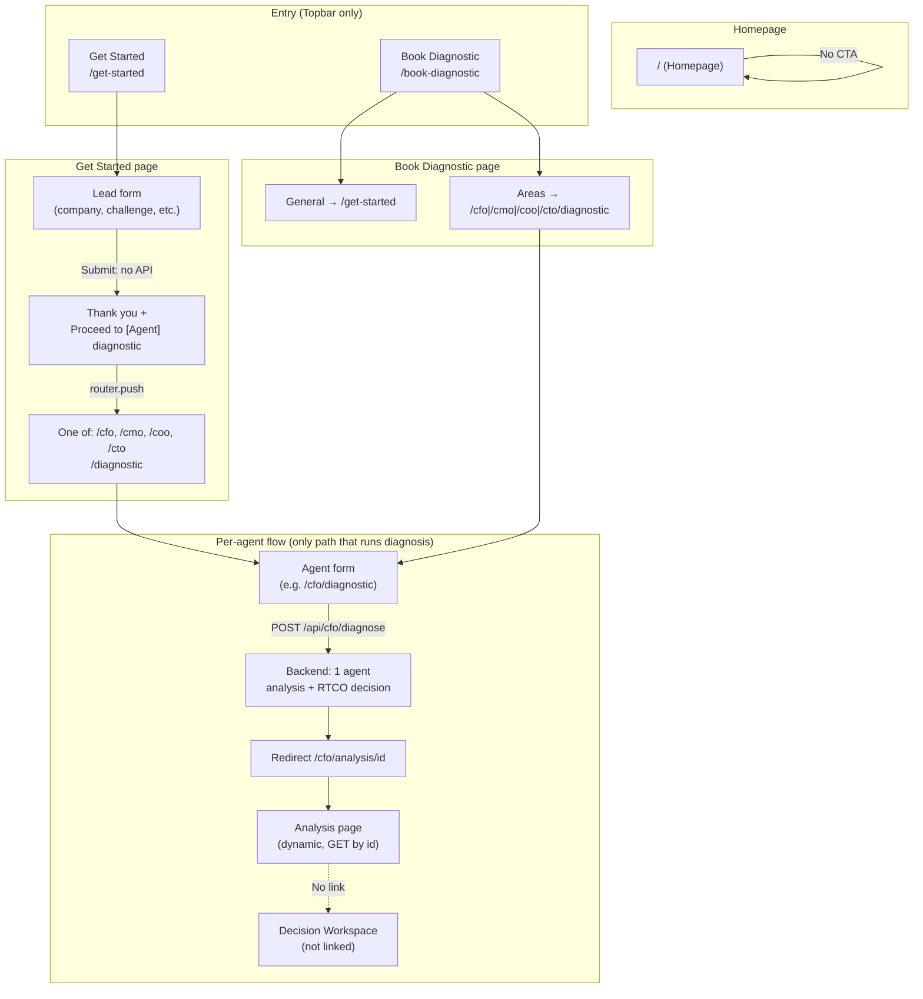
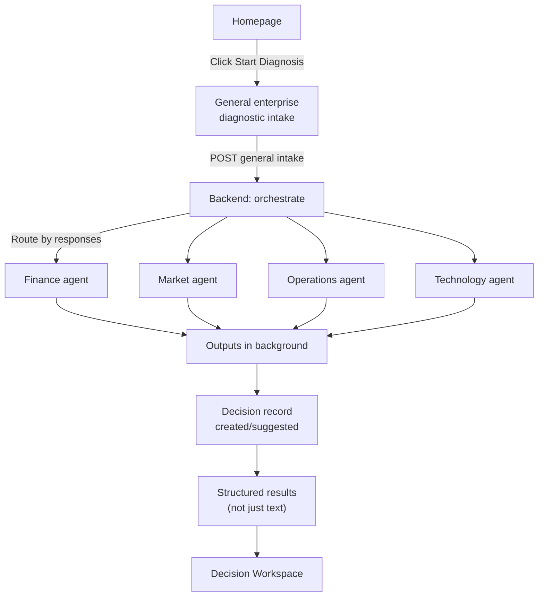

# CLEAR System Architecture Audit Report

**Role:** CLEAR System Architecture Auditor  
**Scope:** Homepage diagnostic flow, frontend routing, backend endpoints, and Decision Workspace connection.  
**Date:** 2025-02-07

---

## Executive Summary

The intended flow (Homepage → Start Diagnosis → General enterprise intake → automatic routing to agents → background outputs → Decision Workspace record) **is not implemented**. The homepage has no diagnostic CTA; there is no general enterprise diagnostic endpoint; and the only path that works is: **Get Started (lead form, no API)** or **Book Diagnostic** → **choice of one agent** → **that agent’s form** → **POST to that agent** → **analysis result page**. Decision records are created in the backend after each agent diagnose, but the frontend does not expose them (no link from analysis to Decision Workspace, no “Bootstrap from analysis” on the analysis page).

---

## 1. Frontend UX Flow Audit

### 1.1 What the homepage CTA buttons currently link to

| Expected (intended) | Current reality |
|--------------------|------------------|
| “Start Diagnosis” CTA on homepage | **There is no diagnostic CTA on the homepage.** The homepage (`/`) is governance copy only (CLEAR, Decision Governance Infrastructure). No button, no link to any diagnostic. |
| Entry point for “general diagnostic” | **None on homepage.** The only global entry points are in the **Topbar**: “Get Started” → `/get-started`, “Book a Call” → `/book-call`. No “Start Diagnosis” in Topbar. |

**Conclusion:** The homepage does not offer any way to start a diagnosis. The intended “User clicks Start Diagnosis” step has no UI.

### 1.2 Whether a unified General Diagnostic intake exists

| Question | Answer |
|---------|--------|
| Does a single “general enterprise diagnostic” page exist? | **No.** There is no route or page that collects one unified intake and then routes to multiple agents. |
| What exists instead? | **Get Started** (`/get-started`): single form (company, industry, employees, stage, **biggest challenge**, name, email, phone). On submit it does **not** call any backend. It shows thank-you text and a button “Proceed to [Finance/Growth/Ops/Tech] decision diagnostic” that **client-side routes** to **one** agent: `/cfo/diagnostic`, `/cmo/diagnostic`, `/coo/diagnostic`, or `/cto/diagnostic` based on “Biggest Challenge.” So the user ends up on **one** agent’s form, not a general intake that fans out to multiple agents. |
| Book Diagnostic (`/book-diagnostic`) | Offers two paths: (1) “Decision Diagnostic (General)” → links to **/get-started** (same lead form, no general diagnostic API). (2) “Decision Areas” → direct links to `/cfo/diagnostic`, `/cmo/diagnostic`, `/coo/diagnostic`, `/cto/diagnostic`. Again, no unified intake. |

**Conclusion:** There is no general enterprise diagnostic intake. There is a lead-capture form that routes the user to **one** agent diagnostic by choice.

### 1.3 Whether the diagnostic form actually posts data to backend endpoints

| Form | POSTs to backend? | Endpoint | Notes |
|------|-------------------|----------|--------|
| Get Started (`/get-started`) | **No** | N/A | `handleSubmit` only sets `submitted(true)`. No `fetch`/`axios`. Data stays in React state. |
| CFO Diagnostic (`/cfo/diagnostic`) | **Yes** | `POST /api/cfo/diagnose` | Uses `postCfoDiagnostic(payload)`, then `router.push(\`/cfo/analysis/${result.id}\`)`. |
| CMO Diagnostic | **Yes** | `POST /api/cmo/diagnose` | Same pattern; redirect to `/cmo/analysis/${response.id}`. |
| COO Diagnostic | **Yes** | `POST /api/coo/diagnose` | Same pattern; redirect to `/coo/analysis/${result.id}`. |
| CTO Diagnostic | **Yes** | `POST /api/cto/diagnose` | Same pattern; redirect to `/cto/analysis/${response.id}`. |

**Conclusion:** Only the **per-agent** diagnostic forms (CFO, CMO, COO, CTO) post to the backend. The “general” path (Get Started) does not post anywhere.

### 1.4 Whether routing after submission is correctly implemented

| Flow | Implemented? | Detail |
|------|--------------|--------|
| After Get Started submit | **Yes, but client-only** | User clicks “Proceed to [X] decision diagnostic” → `router.push(getDiagnosticPath(challenge).path)` → lands on e.g. `/cfo/diagnostic`. No backend involved in this step. |
| After CFO/CMO/COO/CTO diagnostic submit | **Yes** | Backend returns `id`; frontend does `router.push(\`/cfo/analysis/${result.id}\`)` (or respective agent). Routing to analysis page is correct. |

**Conclusion:** Post-submit routing for **agent** diagnostics is correct. There is no “routing after general intake” because there is no general intake API.

### 1.5 Whether the analysis result page is dynamically connected or static

| Page | Dynamic or static? | How data is loaded |
|------|--------------------|--------------------|
| `/cfo/analysis/[id]` | **Dynamic** | `getCfoAnalysis(id)` → `GET /api/cfo/analyses/${id}` in `useEffect`; state `analysis`; loading/error states. |
| `/cmo/analysis/[id]` | **Dynamic** | Same pattern with CMO API. |
| `/coo/analysis/[id]` | **Dynamic** | Same pattern with COO API. |
| `/cto/analysis/[id]` | **Dynamic** | Same pattern with CTO API. |

**Conclusion:** Agent analysis pages are dynamically connected to the backend. They are not static.

---

## 2. Backend Endpoint Audit

### 2.1 Which endpoint should receive the diagnostic submission (intended)

For the **intended** flow:

- One **general enterprise diagnostic** submission (single intake).
- Backend decides which domain(s) apply (finance, market, operations, technology).
- Backend runs or queues analysis for relevant agents.
- Returns or streams a combined/job reference; frontend shows structured results and/or Decision Workspace.

**Expected (conceptual):** Something like `POST /api/diagnose` or `POST /api/enterprise/diagnostic` that accepts a general intake payload and triggers multi-agent or routed analysis.

### 2.2 Whether that endpoint currently exists

| Endpoint | Exists? | Notes |
|----------|--------|--------|
| `POST /api/diagnose` or `/api/enterprise/diagnostic` or any single “general diagnostic” | **No** | Not present in `main.py` or any included router. |
| `POST /api/cfo/diagnose` | **Yes** | CFO-only. |
| `POST /api/cmo/diagnose` | **Yes** | CMO-only. |
| `POST /api/coo/diagnose` | **Yes** | COO-only. |
| `POST /api/cto/diagnose` | **Yes** | CTO-only. |

**Conclusion:** The backend only exposes **per-agent** diagnose endpoints. There is no general enterprise diagnostic endpoint.

### 2.3 Whether diagnose endpoints trigger agent analysis pipelines

| Agent | Trigger pipeline? | Flow |
|-------|-------------------|------|
| CFO | **Yes** | `diagnose()` → tools + optional RAG → `run_ai_cfo_agent()` → save `CFOAnalysis` → return. |
| CMO | **Yes** | `diagnose_marketing()` → `run_ai_cmo_agent()` → save `CMOAnalysis` → return. |
| COO | **Yes** | `diagnose()` → optional RAG → `run_ai_coo_agent()` → save `COOAnalysis` → return. |
| CTO | **Yes** | `diagnose_technology()` → tools + RAG → `run_ai_cto_agent()` → save `CTOAnalysis` → return. |

**Conclusion:** Each agent’s `/diagnose` runs that agent’s analysis pipeline and persists the result. There is no pipeline that takes one general intake and invokes multiple agents.

### 2.4 Whether analysis results are stored and returned correctly

| Agent | Stored? | Returned? | List endpoint |
|-------|---------|-----------|---------------|
| CFO | `CFOAnalysis` in DB | `CFOAnalysisOut` with id, summary, primary_issue, risks, recommendations, action_plan, etc. | `GET /api/cfo/analyses` |
| CMO | `CMOAnalysis` | id, analysis, input_payload, created_at | `GET /api/cmo/analyses` |
| COO | `COOAnalysis` | Serialized analysis with id, etc. | `GET /api/coo/analyses` |
| CTO | `CTOAnalysis` | `CTOAnalysisResponse` with id, analysis, created_at | `GET /api/cto/analyses` |

**Conclusion:** Analysis is stored and returned correctly per agent. Frontend can fetch by id and show the result.

### 2.5 Whether a CLEAR decision record is created after analysis

| Agent | Decision record created? | How |
|-------|--------------------------|-----|
| CFO | **Yes** | After saving analysis, `create_decision_from_analysis()` (RTCO) is called; creates `DecisionRecord`, ledger event `DECISION_CREATED`, evidence link; `analysis.decision_id` set. |
| CMO | **Yes** | Same pattern; on exception, rollback. |
| COO | **Yes** | Same pattern. |
| CTO | **Yes** | Same pattern. |

**Conclusion:** All four agent diagnose flows create a CLEAR decision record (RTCO) and link it to the analysis. The **backend** behavior matches the intent “Decision Workspace record is created or suggested.” The **frontend** does not show this: no link from analysis to `/decisions/[id]`, and no “Bootstrap from analysis” on the analysis page (see Process Flow doc and User Journey doc).

---

## 3. System Flow Mismatch

### 3.1 Intended system behavior (from context)

1. User lands on Homepage.
2. User clicks **Start Diagnosis**.
3. A **general enterprise diagnostic intake** runs.
4. Based on responses, the system **automatically routes** analysis to relevant agents (finance, market, operations, technology).
5. Outputs are **generated in the background**.
6. A **Decision Workspace record** is created or suggested.
7. User sees **structured results**, not just text pages.

### 3.2 Current implemented behavior

1. User lands on Homepage → sees **governance copy only**; **no Start Diagnosis**.
2. User can only enter via Topbar: **Get Started** or **Book Diagnostic** (or direct agent URLs).
3. **Get Started** is a **lead form**; **no API call**; on submit, user is offered a button to “Proceed to [one] decision diagnostic” → client-side redirect to **one** agent’s form.
4. **Book Diagnostic** either sends user to Get Started (same lead form) or to **one** of the four agent diagnostic pages.
5. User fills **one** agent’s form → **POST to that agent’s** `/diagnose` → backend runs **that** agent only, saves analysis, creates **one** decision record.
6. Frontend redirects to **that** agent’s analysis page (`/cfo/analysis/[id]` etc.); page is **dynamic** (fetches by id).
7. Analysis page shows **structured** result (summary, recommendations, action plan) but **no** link to Decision Workspace and **no** “Bootstrap from analysis” control.

### 3.3 Exact technical gaps causing disconnection

| Gap | Where | What’s missing |
|-----|--------|----------------|
| **G1. No homepage diagnostic CTA** | `frontend/src/app/page.tsx` | Homepage has no “Start Diagnosis” (or equivalent) button or link. Governance copy only. |
| **G2. No general diagnostic endpoint** | Backend | No `POST /api/diagnose` (or similar) that accepts a single enterprise intake and routes to multiple agents or a general pipeline. |
| **G3. No general diagnostic intake page** | Frontend | No page that collects one “general” intake and submits it to a single backend endpoint. Get Started is lead capture only and does not POST. |
| **G4. No automatic routing to multiple agents** | Backend | No orchestration that, from one intake, runs or queues finance + market + operations + technology analyses. Each agent is invoked only when the user is on that agent’s form. |
| **G5. No background/async multi-agent outputs** | Backend | Analyses run synchronously per request for one agent. No job queue or async multi-agent run. |
| **G6. Decision record not exposed in UI** | Frontend | Backend creates a decision record and stores `decision_id` on the analysis (where applicable). Frontend does not show it and does not link to `/decisions/[id]`. No “Bootstrap from analysis” or “View in Decision Workspace” on analysis pages. |

---

## 4. Required Fixes (minimal actionable steps)

### 4.1 Frontend routing fixes

| Task | Action |
|------|--------|
| **F1. Homepage entry to diagnosis** | Add a single, restrained CTA on the homepage (e.g. “Start diagnosis” or “Run diagnostic”) that links to the **general diagnostic** entry (see F2). If general diagnostic does not exist yet, link to `/book-diagnostic` or `/get-started` as interim. |
| **F2. General diagnostic entry route** | Define a single route for “general diagnostic” (e.g. `/diagnostic` or `/diagnose`). Either (a) implement a new General Diagnostic intake page that POSTs to a new backend endpoint (see B1), or (b) temporarily redirect to `/book-diagnostic` and document that “Start Diagnosis” = choose one agent until B1 exists. |

### 4.2 Backend endpoint wiring

| Task | Action |
|------|--------|
| **B1. General enterprise diagnostic endpoint** | Add e.g. `POST /api/diagnose` (or `POST /api/enterprise/diagnostic`) that: (1) Accepts a single schema (company/industry/challenges/context, etc.). (2) Determines which domains apply (finance, marketing, operations, technology). (3) Either runs all relevant agent pipelines in one request (sync) or enqueues jobs and returns a job/session id (async). (4) Returns analysis ids and/or decision ids (or job id for polling). |
| **B2. Optional: async pipeline** | If “outputs generated in the background” is required: add a job queue (e.g. Celery/Redis or in-DB job table); general endpoint enqueues per-agent tasks; frontend polls e.g. `GET /api/diagnose/status/{job_id}` until completion, then fetches analysis/decision ids. |

### 4.3 Required API calls (frontend)

| Task | Action |
|------|--------|
| **A1. Get Started (optional)** | If Get Started should feed the general diagnostic: on submit, call `POST /api/diagnose` (or new endpoint) with form data instead of only setting local state; then redirect to a “diagnostic in progress” or “results” page based on response (e.g. job_id or analysis ids). |
| **A2. General diagnostic page** | New page submits to `POST /api/diagnose` (or equivalent); on response, either redirect to a results page (with analysis ids / decision ids) or to a “processing” page that polls for completion. |

### 4.4 State management required

| Task | Action |
|------|--------|
| **S1. Results / job state** | If backend returns a job id: frontend must store it (e.g. React state or URL) and poll until done, then fetch analysis/decision ids and navigate to results. |
| **S2. Multi-result view (optional)** | If multiple agents run: store list of analysis ids (and optionally decision ids); results page can fetch each `/api/{agent}/analyses/{id}` and/or link to `/decisions/[id]`. |

### 4.5 Where Decision Workspace creation should occur

| Aspect | Current | Required |
|--------|---------|----------|
| **Creation** | Already in backend: `create_decision_from_analysis()` after each agent diagnose. | Keep as is for per-agent flow. For general diagnostic, ensure each agent run that produces an analysis also calls `create_decision_from_analysis()` (or equivalent) so one Decision Record per analysis. |
| **Visibility** | Frontend never links to Decision Workspace from analysis. | (1) On analysis page, add link “View in Decision Workspace” (or “Open decision record”) using `decision_id` from analysis if API returns it. (2) Ensure analysis API response includes `decision_id` where available; frontend links to `/decisions/[decision_id]`. (3) Optionally add “Bootstrap from analysis” only when no decision exists yet (e.g. for legacy analyses). |

---

## 5. UI/UX Layer Gap

### 5.1 Why the homepage currently appears as text-heavy static content

- The homepage was intentionally replaced with **governance copy** (CLEAR, Decision Governance Infrastructure): purpose, what CLEAR governs, what it is not, how it is used, institutional posture, closing line.
- **No** primary action (no “Start Diagnosis”) was added in that change, so there is no clear next step and the page reads as informational only.
- The **Topbar** offers “Get Started” and “Book a Call,” but those are not framed as “Start Diagnosis,” so the **diagnostic flow** is not surfaced from the homepage.

So the homepage appears static and text-heavy because: (1) it is copy-only by design, and (2) there is no diagnostic CTA or entry point on the page itself.

### 5.2 What UI interaction layer is missing

| Missing element | Description |
|-----------------|-------------|
| **Diagnostic entry on homepage** | One clear, restrained CTA (e.g. “Start diagnosis”) that takes the user into the diagnostic flow (general intake or choice of path). |
| **Unified diagnostic wizard** | A single multi-step flow that collects **general** enterprise context (and optionally domain-specific follow-ups), instead of forcing an immediate choice of one agent. |
| **Progress states** | For a general diagnostic: “Collecting information” → “Running analysis” → “Complete.” Currently only per-agent flow exists, with redirect to analysis page after POST. |
| **Result visualization** | A **combined** results view when multiple agents have run (e.g. tabs or sections per domain, with links to full analysis and to Decision Workspace). Today only single-agent analysis pages exist. |
| **Decision record preview / link** | On each analysis page: show that a decision record was created and link to it (e.g. “Decision record created” + link to `/decisions/[id]`). Today this is absent; “Bootstrap from analysis” is documented but not implemented on the analysis page. |

---

## 6. Diagrams

### 6.1 Current flow (as implemented)

### 6.2 Intended flow (from context)

### 6.3 Gap in plain language

- **Homepage:** Intended to have a “Start Diagnosis” that kicks off the flow. **Reality:** Homepage has no diagnostic CTA; only Topbar has “Get Started” / “Book Diagnostic.”
- **Intake:** Intended to be one general enterprise diagnostic that the system uses to route to multiple agents. **Reality:** There is no general intake API; only a lead form that routes the **user** to **one** agent form. Each agent form POSTs only to that agent.
- **Routing:** Intended to be automatic (system routes to finance, market, ops, tech based on intake). **Reality:** The user chooses one agent (or is sent to one by “Biggest Challenge”); no backend orchestration of multiple agents.
- **Background outputs:** Intended to be generated in the background. **Reality:** One agent runs synchronously per request; no job queue or multi-agent background run.
- **Decision record:** Intended to be created and surfaced. **Reality:** Backend creates a decision record per analysis; frontend does not show or link to it from the analysis page.

---

## 7. Exact implementation tasks to fix (checklist)

1. **Homepage:** Add one CTA (e.g. “Start diagnosis”) linking to `/diagnostic` or, until it exists, to `/book-diagnostic` or `/get-started`; keep governance copy.
2. **Backend:** Implement `POST /api/diagnose` (or `/api/enterprise/diagnostic`) with a general intake schema; implement routing logic to one or more agents; return analysis ids (and optionally decision ids) or job id for polling.
3. **Frontend general diagnostic page:** New route (e.g. `/diagnostic`); form that submits to the new endpoint; handle response (redirect to results or to “in progress” + polling).
4. **Optional async:** Job queue + status endpoint; frontend poll and then show results when complete.
5. **Analysis page:** Ensure analysis API returns `decision_id` when present; on analysis page, add “View in Decision Workspace” (or “Open decision record”) linking to `/decisions/[decision_id]`.
6. **Get Started (optional):** If it should drive the general diagnostic, POST form data to the new endpoint and redirect to results or progress page instead of only client-side “Proceed to [agent].”
7. **Multi-result view (optional):** If multiple agents run from one intake, add a results page that shows all analysis (and decision) links.

No visual redesign required for these steps; focus on connection between Homepage → Diagnostic → Agent analysis → Decision Workspace.
