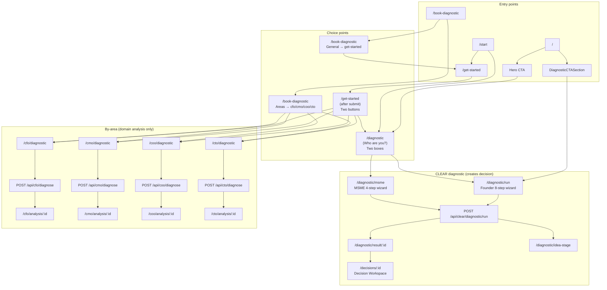

# CLEAR Onboarding & Diagnostic: Audit and Redesign Plan

**Status:** Audit complete; redesign proposed (no code changes).  
**Purpose:** Document current structure, pain points, and a single conversational intake redesign before implementation.

---

## Part 1: Current Structure

### 1.1 Route map (entry points and routes)

| Route | Type | Purpose |
|-------|------|---------|
| **Marketing / top-level CTAs** | | |
| `/` | Landing | Hero CTA: "Try voice intake" → `/diagnostic`; primary CTA → `/start` |
| `/start` | App | How to start: links to `/diagnostic`, `/decisions/new`, `/guided-start` |
| `/get-started` | App | “Quick assessment” form (company, industry, country, employees, stage, challenge, name, email, phone). On submit: saves to **localStorage** (`onboarding_context`), then offers: “Continue to diagnostic (choose Founder or SME)” → `/diagnostic` **or** “{Challenge} diagnostic” → `/cfo|/cmo|/coo|/cto/diagnostic` |
| `/book-diagnostic` | App | Two-box: “Decision Diagnostic (General)” → `/get-started`; “Decision Areas” → links to `/cfo/diagnostic`, `/cmo/diagnostic`, `/coo/diagnostic`, `/cto/diagnostic` |
| `/diagnostic` | App | **Two-box choice:** “Startup founder” → `/diagnostic/run`; “SME / MSME” → `/diagnostic/msme`. Footer: “Choose Finance, Growth, Ops, or Tech” → `/book-diagnostic` |
| `/diagnostic/start` | Redirect | Redirects to `/diagnostic` |
| `/diagnostic/run` | Wizard | **Founder 8-step** wizard (`DiagnosticWizard`). Submit → `POST /api/clear/diagnostic/run` → `/diagnostic/result/:decision_id` or `/diagnostic/idea-stage` |
| `/diagnostic/msme` | Wizard | **MSME 4-step** wizard (`MSMEDiagnosticWizard`). Submit → same `POST /api/clear/diagnostic/run` → `/diagnostic/result/:decision_id` or `/diagnostic/idea-stage` |
| `/diagnostic/idea-stage` | Page | Shown when user says “No (idea or validation stage)” in founder wizard or backend returns `idea_stage: true`. Form: email → `POST /api/clear/diagnostic/idea-stage` (no decision created). |
| `/diagnostic/result/[run_id]` | Page | Result after CLEAR diagnostic: snapshot + CTAs (playbooks, AI advisor, human review, Decision Workspace). `run_id` is `decision_id`. |
| **By-area (CXO) flows** | | |
| `/cfo/diagnostic`, `/cmo/diagnostic`, `/coo/diagnostic`, `/cto/diagnostic` | Form | Domain-specific long forms (e.g. CFO: 4 steps, many fields). Submit → `POST /api/cfo|/cmo|/coo|/cto/diagnose` → **domain analysis** (not CLEAR decision). Redirect → `/cfo/analysis/:id` (etc.). |
| `/cfo/analysis/[id]`, `/cmo/analysis/[id]`, etc. | Page | Domain analysis result (separate from CLEAR decision workspace). |
| **Segment-specific marketing** | | |
| `/for-founders` | Marketing | CTA → `/diagnostic?role=founder` (query **not read** by diagnostic page) |
| `/for-enterprises` | Marketing | CTA → `/diagnostic?role=enterprise` (query **not read**) |
| **Other** | | |
| `/guided-start` | Form | Request guided onboarding (org, team size, challenge, email). Submit → backend; no diagnostic. Success → link to `/start`. |
| `/decisions`, `/decisions/new`, `/decisions/[id]` | App | List/create/workspace; “New decision” / “Create from diagnostic” point to `/diagnostic`. |
| Activation checklist, dashboard, resources, etc. | App | Various links to `/diagnostic` or “Start diagnostic”. |

**Summary:**  
- **CLEAR diagnostic (decision-creating):** Entry = `/diagnostic` → choose Founder vs SME → `/diagnostic/run` or `/diagnostic/msme` → one wizard → `POST /api/clear/diagnostic/run` → decision + `/diagnostic/result/:id` → Decision Workspace.  
- **By-area (CXO):** Entry = `/get-started`, `/book-diagnostic`, or sidebar → `/cfo|/cmo|/coo|/cto/diagnostic` → domain form → `POST /api/{cfo|cmo|coo|cto}/diagnose` → domain analysis → `/cfo/analysis/:id` (no decision workspace).  
- **Identity/onboarding:** Collected on `/get-started` (optional signup mention); stored in **localStorage** (`clear_onboarding_context`). Used by CLEAR diagnostic run only when calling `runDiagnosticRun(..., getOnboardingContext())`.

---

### 1.2 Segment flows (step-by-step)

#### A. SME operator

| Step | Screen | User choice / action | Data captured | Stored |
|------|--------|----------------------|---------------|--------|
| 1 | Landing or `/get-started` or `/book-diagnostic` or `/diagnostic` | Clicks into diagnostic path | — | — |
| 2 | `/diagnostic` | Chooses **“SME / MSME”** (card) | — | — |
| 3 | `/diagnostic/msme` (same page, steps 1–4) | Step 1: Multi-select “which of these feel most true” + optional notes | challenges[], challengesNotes | In-memory (wizard state) |
| 4 | Same page | Step 2: Primary focus (Finance/Growth/Ops/Tech) + notes | primaryFocus, primaryFocusNotes | In-memory |
| 5 | Same page | Step 3: Optional document upload | uploadedFiles | In-memory |
| 6 | Same page | Step 4: “Generate my decision snapshot” | — | — |
| 7 | Submit | — | — | **Backend:** `POST /api/clear/diagnostic/run` with `diagnostic_data` (flow: msme, challenges, …) + optional `onboarding_context` from localStorage. **DB:** diagnostic_runs + decision + artifact. |
| 8 | `/diagnostic/result/:decision_id` | Sees snapshot + “Open playbooks”, “Open advisor chat”, “Request human review”, “Open Decision Workspace” | — | — |

**Branch:** If backend returns `idea_stage: true` → redirect to `/diagnostic/idea-stage` (rare for MSME path; MSME wizard always sends `operatingAndRevenue: "yes"`).

**First screen:** Depends on entry (e.g. `/diagnostic` → two-box; or `/get-started` → form then choice).  
**Screens:** 1 (entry) + 1 (MSME wizard with 4 steps) + 1 (result) = multiple steps, one wizard page, one result page.  
**Where it branches:** At `/diagnostic` (Founder vs MSME). After submit, backend can off-ramp to idea-stage.

---

#### B. Startup founder

| Step | Screen | User choice / action | Data captured | Stored |
|------|--------|----------------------|---------------|--------|
| 1 | Landing or `/diagnostic/run` (CTA) or `/diagnostic` | Clicks “Start capability diagnostic” or “Startup founder” | — | — |
| 2 | `/diagnostic/run` (wizard steps 1–9) | Step 1: “Are you running an operating business?” Yes/No | operatingAndRevenue | In-memory |
| 2b | (If “No”) | Redirect to `/diagnostic/idea-stage` | — | No decision created |
| 3 | Same page | Step 2: Business stage (dropdown + free text) | businessStage, businessStageDropdown | In-memory |
| 4 | Same page | Step 3: What’s going on + primary area | situationDescription, primaryAreaAffected | In-memory |
| 5 | Same page | Step 4: Themes | primaryTheme, situationClarifiers | In-memory |
| 6 | Same page | Step 5: Most urgent | mostUrgent, mostUrgentNotes | In-memory |
| 7 | Same page | Step 6: Diagnostic goal | diagnosticGoal, diagnosticGoalNotes | In-memory |
| 8 | Same page | Step 7: Optional docs | uploadedFiles | In-memory |
| 9 | Same page | Step 8: Decision horizon | decisionHorizon, decisionHorizonDropdown | In-memory |
| 10 | Same page | Step 9: “Generate my decision snapshot” | — | — |
| 11 | Submit | — | — | **Backend:** `POST /api/clear/diagnostic/run`; **DB:** diagnostic_runs, decision, artifact. |
| 12 | `/diagnostic/result/:decision_id` or `/diagnostic/idea-stage` | Snapshot + next steps, or idea-stage message + email signup | — | — |

**Branch:** Step 1 “No” → `/diagnostic/idea-stage`. Backend can also return `idea_stage: true` for certain `businessStage` values.  
**First screen:** `/diagnostic` (two-box) or directly `/diagnostic/run` (if CTA skips two-box).  
**Screens:** 1 (optional) + 1 wizard page (9 steps) + 1 result or idea-stage.

---

#### C. Social enterprise

**Not a dedicated segment.** No route or role labeled “social enterprise”. User would use either Founder or MSME path; no separate flow or branching.

---

#### D. Aspiring entrepreneur (idea-stage)

**First screen:** Same as founder; at step 1 of `/diagnostic/run` user selects “No (idea or validation stage)”.  
**Flow:** Redirect to `/diagnostic/idea-stage` → single page: message “CLEAR is for operating businesses” + email signup → `POST /api/clear/diagnostic/idea-stage`. No decision, no diagnostic run.  
**Data:** Email (and optional short_text from backend); stored by backend (idea_stage signup), not in CLEAR decision/diagnostic_runs.

---

#### E. Legacy by-area (CXO) diagnostic flow

| Step | Screen | User choice / action | Data captured | Stored |
|------|--------|----------------------|---------------|--------|
| 1 | `/get-started` (after submit) or `/book-diagnostic` or sidebar | “Continue to diagnostic” vs “Finance/Growth/Ops/Tech diagnostic” or direct link to e.g. `/cfo/diagnostic` | — | — |
| 2 | `/cfo/diagnostic` (example) | Multi-step form (e.g. CFO: 4 steps – Overview, Numbers, Structure, Profile) | Full CFO schema (challenges, revenue, expenses, funding, systems, etc.) | In-memory until submit |
| 3 | Submit | — | — | **Backend:** `POST /api/cfo/diagnose` (not CLEAR diagnostic). **DB:** CFO analysis row (separate from diagnostic_runs/decisions). |
| 4 | `/cfo/analysis/:id` | Domain-specific analysis result (summary, recommendations, action plan). No Decision Workspace; different UX. | — | — |

**Note:** CXO forms can **read** `diagnostic-prefill` from localStorage (if something had set it) to prefill e.g. “situation description”. In the codebase, `setDiagnosticPrefill` is **never called**; prefill is only consumed. So prefill is effectively unused unless set elsewhere (e.g. future “go deeper” from decision workspace).

**Where diagnostic run is created:** Only on **CLEAR** path: `POST /api/clear/diagnostic/run`. CXO path creates **domain analysis** only (cfo_analyses, etc.), no CLEAR decision.

**After submit:**  
- CLEAR path → `/diagnostic/result/:decision_id` → Decision Workspace, playbooks, AI advisor, human review.  
- CXO path → `/cfo/analysis/:id` (or cmo/coo/cto) → domain analysis page only.

---

### 1.3 What is causing fragmentation

- **Two-box at `/diagnostic`:** User must choose “Startup founder” vs “SME / MSME” up front. Different wizards (9 steps vs 4), different questions, same backend endpoint. Feels like two funnels.
- **Multiple entry points:** Landing → `/diagnostic` or `/start`; `/start` → `/diagnostic` or `/decisions/new` or `/guided-start`; `/get-started` → long form then “diagnostic (Founder or SME)” **or** “Finance/Growth/Ops/Tech diagnostic”; `/book-diagnostic` → “General” (→ `/get-started`) vs “Decision Areas” (→ CFO/CMO/COO/CTO). User can feel they are “starting again” when moving between these.
- **Navigation changes:** Each choice often loads a new route (e.g. `/diagnostic` → `/diagnostic/run` → …). No single continuous page; progress is “step N of M” within one wizard, but entry and result are different pages.
- **Redundant / repeated:**  
  - Identity (name, industry, country, etc.) only collected on `/get-started`; not on `/diagnostic` or wizards. So users entering via `/diagnostic` or `/diagnostic/run` never see a light identity step unless they came from `/get-started`.  
  - “Choose your path” appears in different guises: two-box on `/diagnostic`, two-box on `/book-diagnostic` (General vs Areas), and after `/get-started` (Founder/SME vs area).  
  - Role/segment is fixed by which card/link they click, not by a single selector.
- **Two different backends:**  
  - CLEAR: `POST /api/clear/diagnostic/run` → decision, artifact, `/diagnostic/result/:id`, Decision Workspace.  
  - CXO: `POST /api/cfo|/cmo|/coo|/cto/diagnose` → domain analysis, `/cfo/analysis/:id`. Different data models and end states. So “diagnostic” means two different things.
- **Dead or unused:** `?role=founder` and `?role=enterprise` from for-founders/for-enterprises are not read by `/diagnostic`. `/diagnostic/start` only redirects to `/diagnostic`.

---

### 1.4 Flow diagram (route-level)

**End states:**

- **CLEAR path:** `/diagnostic/result/:decision_id` → playbooks, advisor chat, human review, Decision Workspace.
- **Idea-stage:** `/diagnostic/idea-stage` (no decision).
- **CXO path:** `/cfo/analysis/:id` (or cmo/coo/cto) — no Decision Workspace.

---

## Part 2: Proposed Redesign (no code yet)

### 2.1 Single end-to-end conversational intake – behavior

- **Step 1 – Light identity:** One screen: name, location, industry, optional sign-in. Stored in existing `onboarding_context` (e.g. localStorage and/or backend when signed in).
- **Step 2 – Role selection embedded:** Replace two-box with one selector: SME owner/operator, Startup founder, Social enterprise leader, Aspiring entrepreneur; optional later: Capital partner. Single field, no separate “Who are you?” page.
- **Step 3 – Progressive reveal on one page:** One container; question 1 → on answer, question 2 appears below; earlier answers collapse into a short summary; no full-page transitions.
- **Step 4 – Adaptive branching by role:** Different question sets per role; same interaction pattern (one page, progressive reveal).
- **Step 5 – Progress indicator:** e.g. “Step 2 of 6” and a progress bar (reuse/extend `DiagnosticProgress` behavior).

### 2.2 Information architecture for the intake engine

**Question schema (conceptual – JSON/TS object):**

- **Identity block (step 0 or 1):**  
  `{ name?, email?, location?, industry?, company_name?, company_size_band?, optional_sign_in?: boolean }`  
  Map to existing `OnboardingContext` and/or auth.

- **Role:**  
  `role: "sme_owner" | "startup_founder" | "social_enterprise" | "aspiring_entrepreneur" | "capital_partner"`  
  Drives which question set loads.

- **Branch-specific question sets:**  
  - Each set is an ordered list of “steps” (e.g. id, type, question text, options, validation, optional `show_if` based on prior answers).  
  - Founder set: derived from current DiagnosticWizard (operating business Y/N, stage, situation, themes, urgency, goal, docs, horizon).  
  - MSME set: derived from MSMEDiagnosticWizard (challenges, primary focus, docs).  
  - Aspiring: short set ending in “idea-stage” (email capture, no run).  
  - Social enterprise: same as founder or MSME with optional extra questions (to be defined).  
  - Capital partner: placeholder for future set.

- **Unified payload for backend:**  
  - `onboarding_context`: from identity step (same shape as today).  
  - `diagnostic_data`: all answers keyed by step id + `role`, `flow` (e.g. `"msme"` or `"founder"`). Include existing fields backend expects (`situationDescription`, `businessStage`, `operatingAndRevenue`, `challenges`, `primaryFocus`, etc.) so **existing** `POST /api/clear/diagnostic/run` and backend mapping still work.  
  - No change to backend contract initially; only the way the frontend builds `diagnostic_data` changes (single intake → same payload shape).

**Branching logic:**

- After role selection, load the question set for that role.
- Optional `show_if` per question (e.g. “operating business = no” → skip to idea-stage branch and show email step).
- Backend already supports `idea_stage`; front-end can either send a minimal run and let backend return `idea_stage: true`, or skip run and call only `POST /api/clear/diagnostic/idea-stage` when role is aspiring and/or operating = no.

**Compatibility with existing backend:**

- Keep using `POST /api/clear/diagnostic/run` with `onboarding_context` + `diagnostic_data`.
- In `diagnostic_data`, keep or map: `operatingAndRevenue`, `businessStage`, `situationDescription`, `primaryAreaAffected`, `situationClarifiers`, `primaryTheme`, `mostUrgent`, `diagnosticGoal`, `decisionHorizon`, `documentNames`, and for MSME `flow: "msme"`, `challenges`, `primaryFocus`.  
- Backend `run_service` and `mapping.build_all_payloads` already accept a dict; ensure intake engine outputs the same keys they expect.  
- Idea-stage: keep `POST /api/clear/diagnostic/idea-stage` for email capture when user is aspiring or “not operating”.

**Mapping answers into diagnostic run payload:**

- Define a single function or small module: `intakeAnswersToDiagnosticData(role, answers): DiagnosticData` that:
  - Takes the unified answer set from the intake UI.
  - Returns the same `diagnostic_data` shape that `runDiagnosticRun` and the backend use today.  
- Reuse existing backend mapping from `diagnostic_data` to agent payloads; no backend change required for Phase 1.

### 2.3 UX spec

- **Layout:** One scrollable container; identity at top (or first step); then role selector; then a single “question area” where the current question is prominent and previous ones collapse to a short summary (e.g. one line per answered question, expandable to edit). Optional sticky progress bar at top.
- **Progress indicator:** “Step K of N” + bar; N = total steps for current role (identity + role + branch steps). Update when moving to next step; optional “sub-steps” within a step if needed.
- **Back and edit:** Back button goes to previous step; editing a prior answer (from summary) expands that step again and allows re-answer; then user can “continue” forward again. No full reload; state in React (or equivalent) with optional persistence (e.g. sessionStorage) for refresh.
- **Validation:** Per-step validation before “Next”; errors inline. On submit, validate required fields for the run payload; if idea-stage, only validate email.
- **Loading:** On final “Generate” (or “Finish”), show loading state (e.g. “Generating…” with spinner); disable back/next. On success, redirect to `/diagnostic/result/:id` or `/diagnostic/idea-stage` as today.
- **Error states:** Network/API errors shown inline with retry; do not clear the form.

### 2.4 Migration plan

- **Replace (by the new single intake):**
  - `/diagnostic` two-box page → replaced by single intake (identity + role + progressive questions).
  - `/diagnostic/run` (Founder wizard) → merged into intake; role = startup founder.
  - `/diagnostic/msme` (MSME wizard) → merged into intake; role = SME owner.
- **Keep as-is for now:**
  - `/diagnostic/result/[run_id]` — unchanged; intake still calls `POST /api/clear/diagnostic/run` and redirects here.
  - `/diagnostic/idea-stage` — unchanged; intake redirects here when idea-stage (and still uses existing idea-stage API).
  - `/decisions`, `/decisions/new`, `/decisions/[id]` — no change.
- **Legacy / deprecate later:**
  - `/get-started` — either redirect to new intake with “identity first” or keep as alternate entry that pre-fills identity then redirects to intake. Prefer one canonical entry (new intake) and redirect `/get-started` → intake.
  - `/book-diagnostic` — redirect to new intake; “Finance, Growth, Ops, Tech” can become a “focus area” question inside intake later, or remain as links to existing CXO flows during transition.
  - CXO routes (`/cfo/diagnostic`, etc.): keep as legacy “by-area” path; do not remove until product decision to merge or drop. New intake does not replace them in Phase 1; marketing CTAs can point to new intake for “general” diagnostic.
- **Avoid breaking existing routes:**
  - Keep `/diagnostic/result/:id` and `/decisions/:id` URLs and behavior.
  - Keep `POST /api/clear/diagnostic/run` and `POST /api/clear/diagnostic/idea-stage` contracts.
  - Optional: keep `/diagnostic/run` and `/diagnostic/msme` as redirects to the new intake with a query (e.g. `?role=founder` / `?role=msme`) so old links still work and pre-select role.

### 2.5 Optional later

- **Capital partner** and **social enterprise** question sets (and role options) when product is ready.
- **Single “focus area” (Finance/Growth/Ops/Tech)** inside intake to pre-bias CLEAR synthesis or suggest a follow-up CXO diagnostic link after result.
- **Unified CXO + CLEAR:** Later, by-area flows could be refactored to either (a) call CLEAR diagnostic with a “domain-only” mode and still create a decision, or (b) remain separate and linked from result page (“Go deeper: Finance diagnostic”).

---

**End of document.** No code has been changed; this is the audit and redesign plan for your approval before implementation.
