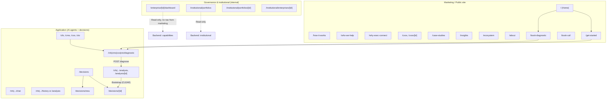
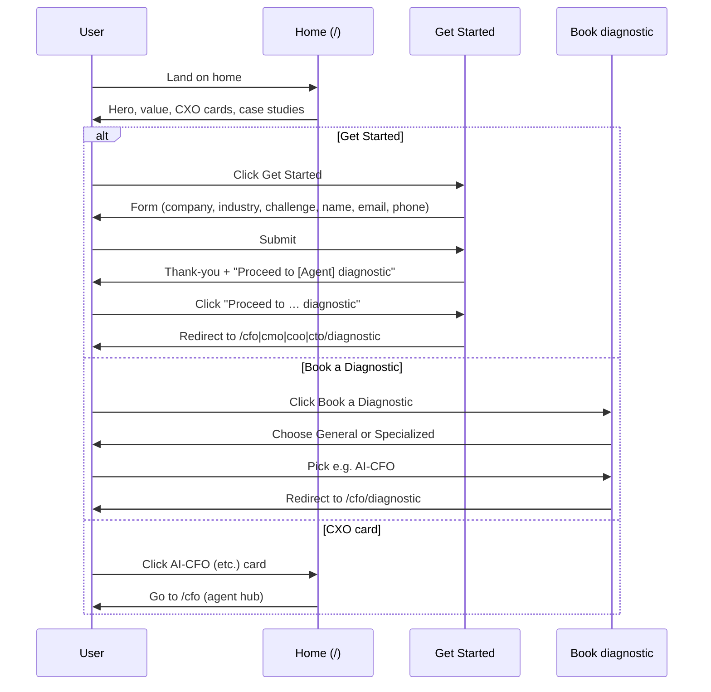
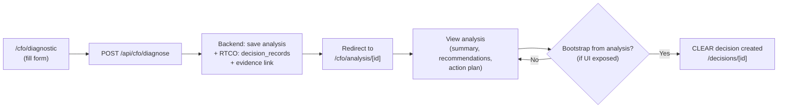
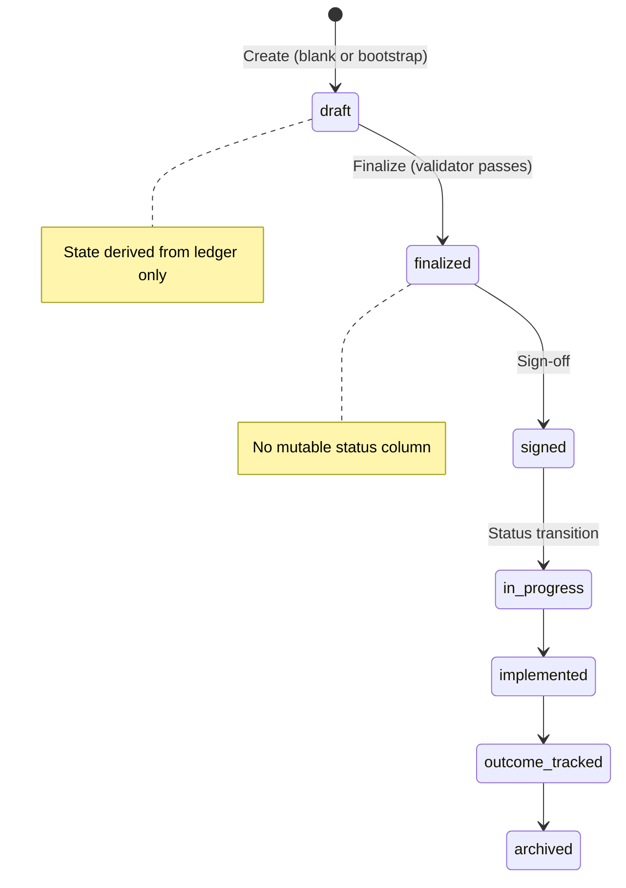
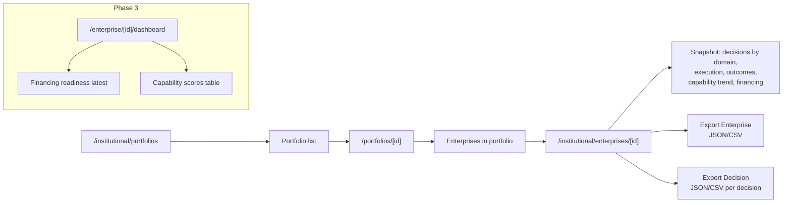
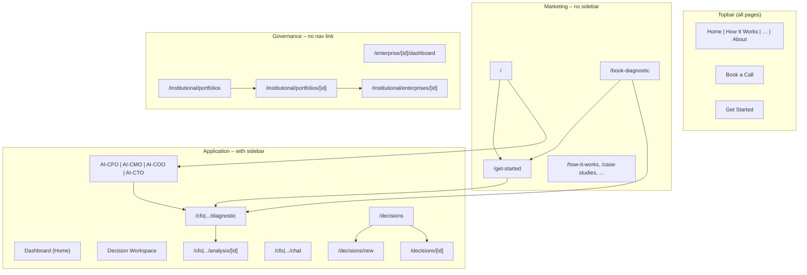

# Exec-Connect: User Journey Flow & Architecture Overview

This document gives a **detailed overview of what is intended, what is built, and how the marketing site syncs with the internal (governance) application**. Use it to align marketing messaging with available features and to plan audits.

---

## 1. High-level architecture (three layers)

**Summary:**

| Layer | Purpose | Visible in top nav? | Sidebar? |
|-------|---------|---------------------|----------|
| **Marketing** | Awareness, lead capture, “Get Started” / “Book diagnostic” | Yes (Home, How It Works, … Get Started, Book a Call) | No sidebar |
| **Application** | Run AI diagnostics, view analyses, chat, create/view governed decisions | No direct top nav; entry via Home (CXO cards) or Get Started / Book diagnostic | Yes (Dashboard, AI agents, Decision Workspace) |
| **Governance** | Enterprise dashboard, portfolios, snapshots, exports | No; access by URL only | No (not in sidebar) |

---

## 2. Frontend route map (what is built)

### 2.1 Marketing routes (no sidebar; Topbar only)

| Route | Purpose | Intended flow |
|-------|---------|----------------|
| `/` | Home: hero, value props, How It Works, CXO cards, case studies, “Is Exec Connect right for you?” | → Get Started, Book a Diagnostic, or CXO agent hubs |
| `/how-it-works` | Explain 4 steps | Learn more |
| `/who-we-help` | Target audience | Learn more |
| `/why-exec-connect` | Value proposition | Learn more |
| `/cxos`, `/cxos/[id]` | Our CXOs / human advisors | Awareness |
| `/case-studies` | Proof points | Awareness |
| `/insights` | Content | Awareness |
| `/ecosystem` | Ecosystem view | Awareness |
| `/about` | About us | Awareness |
| `/get-started` | Lead capture + qualification form; **after submit → “Proceed to [Agent] diagnostic”** | Submit → thank-you → go to `/cfo|cmo|coo|cto/diagnostic` |
| `/book-call` | Book a call | Contact |
| `/book-diagnostic` | Choose: General (→ Get Started) or Specialized (→ agent diagnostics) | → Get Started or `/cfo|.../diagnostic` |

### 2.2 Application routes (sidebar when in app area)

| Route | Purpose | Backend / governance link |
|-------|---------|----------------------------|
| `/cfo`, `/cmo`, `/coo`, `/cto` | Agent hub / landing | Entry to diagnostic, history, chat |
| `/{agent}/diagnostic` | **Run AI diagnostic** (agent-specific form) | POST `/api/{agent}/diagnose` → analysis saved; **RTCO**: `decision_records` + evidence link created |
| `/{agent}/analysis`, `/{agent}/analysis/[id]` | List / view analysis result | GET analysis; **optional**: “Bootstrap from analysis” → CLEAR decision (not on all analysis pages in UI yet) |
| `/{agent}/chat` | Agent chat | Chat API |
| `/{agent}/history` (e.g. CFO) or `/{agent}/analysis` | Analyses list | List analyses |
| `/decisions` | Decision list (CLEAR) | GET `/api/clear/decisions` |
| `/decisions/new` | Create **blank** draft decision | POST `/api/clear/decisions`; copy says “run diagnostic first, then Bootstrap from analysis” |
| `/decisions/[id]` | Decision detail: artifact, finalize, sign-off, ledger, evidence | CLEAR APIs; state from ledger |

### 2.3 Governance / internal routes (no top nav; URL only)

| Route | Purpose | Backend |
|-------|---------|---------|
| `/enterprise/[enterpriseId]/dashboard` | **Phase 3:** Financing readiness (latest) + capability scores table | GET capabilities/financing-readiness |
| `/institutional/portfolios` | **Phase 4:** Portfolios list | GET `/api/institutional/portfolios` |
| `/institutional/portfolios/[portfolioId]` | Enterprises in portfolio | GET portfolio enterprises |
| `/institutional/enterprises/[enterpriseId]` | Snapshot + export buttons | GET snapshot; export = direct backend download |

---

## 3. Backend API map (what supports the flows)

| Area | Prefix / routes | Supports |
|------|------------------|----------|
| **Agents** | `/api/cfo`, `/api/cmo`, `/api/coo`, `/api/cto` | Diagnose, analyses, chat |
| **CLEAR governance** | `/api/clear` | Enterprises, decisions, artifact, finalize, sign-off, ledger, evidence, chat-session, **contract**, event-sourced tasks/outcomes |
| **Decisions (read)** | `/api/decisions` (decision_routes) | RTCO decision list/detail/versions |
| **Enterprise** | `/api/enterprises`, `/api/decisions/{id}/context` | Enterprise CRUD, decision context (latest + history) |
| **Execution** | `/api/decisions/{id}/tasks`, `/api/tasks/{id}`, … | Tasks/milestones (mutable); CLEAR also has event-sourced task/outcome APIs |
| **Outcomes** | `/api/decisions/{id}/outcomes` | Outcomes (mutable + event-sourced under CLEAR) |
| **Documents** | `/api/documents` | Document upload / RAG linkage |
| **Capabilities (Phase 3)** | `/api/capabilities` | Recompute, enterprise capabilities, financing-readiness |
| **Institutional (Phase 4)** | `/api/institutional` | Portfolios, portfolio enterprises, enterprise snapshot, decision/enterprise export |

---

## 4. User journey flows (Mermaid)

### 4.1 Visitor → Lead (marketing)

### 4.2 Diagnostic → Analysis (application)

### 4.3 Decision lifecycle (governance – CLEAR)

### 4.4 Governance / institutional (internal user)

---

## 5. What is visible vs internal

| Item | Visible on marketing / app UI? | How to access | Notes |
|------|--------------------------------|----------------|-------|
| Home, How It Works, Get Started, Book diagnostic, etc. | Yes (top nav or home) | Normal navigation | Marketing layer |
| AI-CFO/CMO/COO/CTO hubs, diagnostic, analysis, chat | Yes (sidebar when in /cfo etc.) | Home → CXO card, or Get Started → Proceed to diagnostic, or Book diagnostic | Application layer |
| Decision list, New decision, Decision detail | Yes (sidebar “Decision Workspace”) | Click Decision Workspace or go to /decisions | CLEAR; state from ledger |
| Enterprise dashboard (Phase 3) | No in nav | Direct URL: `/enterprise/[id]/dashboard` | Read-only; needs backend + data |
| Institutional portfolios / snapshot / exports (Phase 4) | No in nav | Direct URL: `/institutional/portfolios`, then drill down | Read-only; export = pass-through download |
| GET /api/clear/contract | No (API only) | Backend | Semantic lock for auditors |
| Proof artifacts (immutability, API smoke) | No (files) | `backend/docs/proofs/` | For auditor handoff |

---

## 6. Intended vs built (summary table)

| Capability | Intended | Built (frontend) | Built (backend) | Sync note |
|------------|----------|------------------|-----------------|-----------|
| Marketing landing + lead capture | Yes | Yes (/, get-started, book-call, book-diagnostic, etc.) | N/A | Aligned |
| “Proceed with diagnosis” after Get Started | Yes | Yes (Proceed to [Agent] diagnostic after submit) | N/A | Fixed |
| Run agent diagnostic | Yes | Yes (per-agent diagnostic page) | Yes (POST diagnose; RTCO record + evidence) | Aligned |
| View analysis result | Yes | Yes (analysis/[id]) | Yes | Aligned |
| Bootstrap decision from analysis | Yes | Mentioned on /decisions/new; not always on analysis page | Yes (CLEAR bootstrap API) | Optional: add “Bootstrap from analysis” on analysis page |
| Decision list & detail (CLEAR) | Yes | Yes (/decisions, /decisions/[id]) | Yes (ledger, finalize, sign-off) | Aligned |
| Enterprise dashboard (Phase 3) | Yes | Yes (read-only table + financing) | Yes (capabilities, financing-readiness) | Access by URL only |
| Institutional portfolios + snapshot + export (Phase 4) | Yes | Yes (portfolios → portfolio → enterprise snapshot; export buttons) | Yes | Access by URL only |
| Contract + proofs for auditors | Yes | No (backend/docs + API) | Yes | By design |

---

## 7. Diagram: Full site map (frontend)

---

## 8. Sync checklist (marketing ↔ built)

- **Marketing says “Get Started”** → Leads to `/get-started`; after submit user can **“Proceed to [Agent] diagnostic”** → aligns with built diagnostic flow.
- **Marketing says “Book a Diagnostic”** → Leads to `/book-diagnostic` → user picks General (Get Started) or Specialized (agent diagnostic) → aligns with built routes.
- **Marketing says “How It Works” (4 steps)** → Step 2 “AI Diagnostic” is implemented as agent diagnostic pages; Step 4 “Execute & Impact” is partially implemented (execution/outcomes, Phase 2/4).
- **“Explore AI Agents” on Get Started** → Currently links to `/`; could link to a single “Pick an agent” page or keep home.
- **Enterprise dashboard & institutional** → Not in marketing copy; internal/auditor use; access by URL. Optional: add a “For partners” or “Portfolio view” link in footer or post-login later.
- **Decision Workspace** → Not in top nav; in sidebar when user is in app. Marketing does not need to mention it unless targeting governance users.

---

## 9. File references (quick index)

| Topic | File(s) |
|-------|--------|
| Process flow Get Started vs diagnosis | `frontend/docs/PROCESS_FLOW_GET_STARTED_AND_DIAGNOSIS.md` |
| Phase 1B execution (governance enforcement) | `backend/docs/PHASE_1B_EXECUTION_PLAN.md` |
| Phase 2/3/4 task queue | `backend/docs/PHASE_2_3_4_TASK_QUEUE.md` |
| Immutability proof (SQL + triggers) | `backend/docs/CLEAR_IMMUTABILITY_PROOF.md` |
| Proof artifacts | `backend/docs/proofs/` |
| Shell (sidebar vs no sidebar) | `frontend/src/components/layout/Shell.tsx` |
| Topbar nav | `frontend/src/components/layout/Topbar.tsx` |
| Sidebar (agent + decisions) | `frontend/src/components/layout/Sidebar.tsx` |

---

This overview should be enough to run user journey audits, align marketing with built features, and plan any missing links (e.g. “Bootstrap from analysis” on analysis pages or a single “Pick an agent” entry from Get Started).
